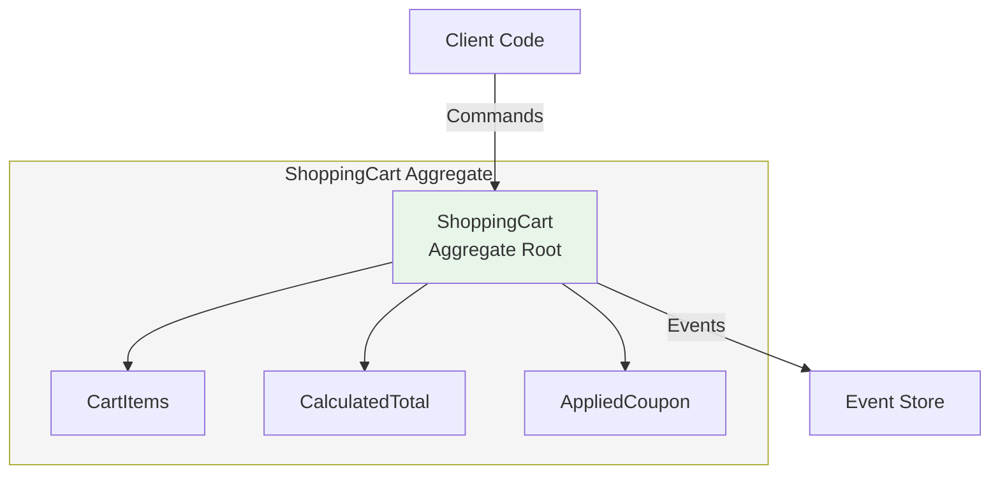
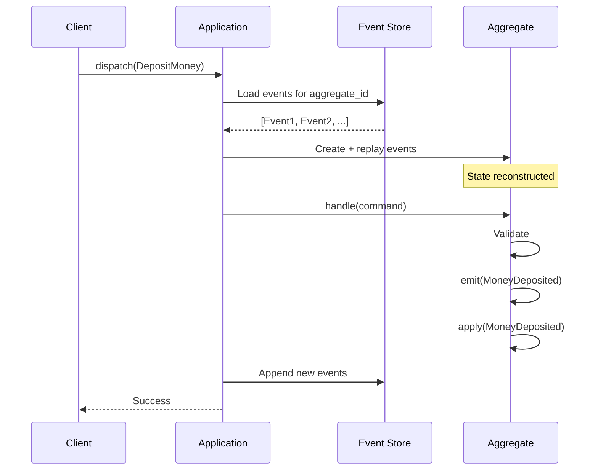
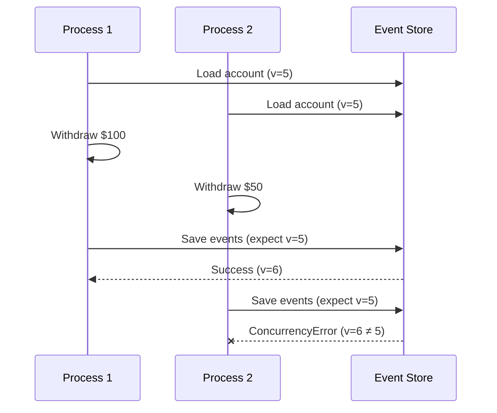
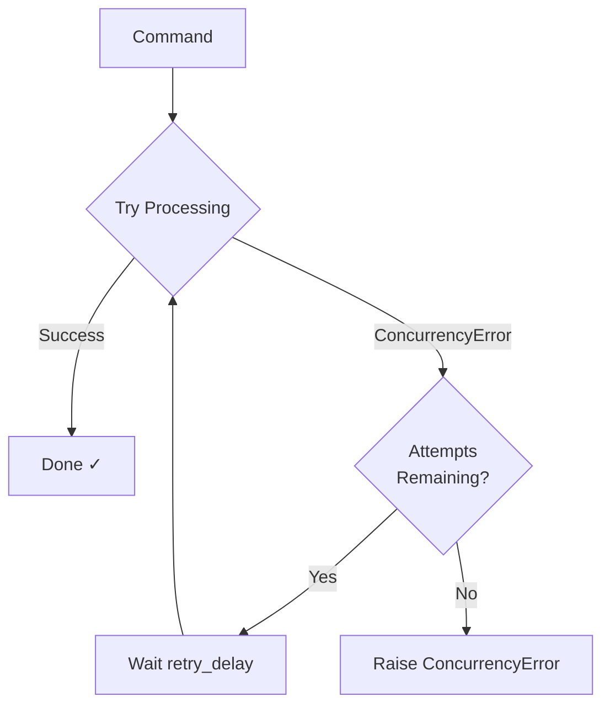

# Aggregates

An **aggregate** is a cluster of domain objects treated as a single unit for data changes. Originating from Domain-Driven Design, aggregates are the core building blocks for modeling business domains in event-sourced systems.

## The Problem: Consistency in Complex Domains

Real-world domains have complex relationships. Consider a shopping cart:

```
┌─────────────────────────────────────────┐
│             Shopping Cart               │
├─────────────────────────────────────────┤
│  - items: [Item, Item, Item]            │
│  - customer: Customer                   │
│  - shipping_address: Address            │
│  - applied_coupon: Coupon               │
│  - calculated_total: Money              │
└─────────────────────────────────────────┘
```

When adding an item, multiple things must happen atomically:

1. Validate the item is in stock
2. Add item to the list
3. Recalculate the total
4. Check if the coupon still applies
5. Update the shipping cost

If any step fails or executes partially, the cart is left in an inconsistent state. How do we ensure all-or-nothing changes?

## The Solution: Consistency Boundaries

An aggregate defines a **consistency boundary**—a scope within which all invariants must hold after every operation. The aggregate root is the single entry point for all modifications.



Key principles:

- **Single entry point**: All changes go through the aggregate root
- **Internal consistency**: Invariants are checked on every change
- **Transactional boundary**: One aggregate per transaction
- **Reference by ID**: Aggregates reference others by ID, not direct object reference

## Anatomy of an Aggregate

In Interlock, aggregates extend the `Aggregate` base class:

```python
from interlock.domain import Aggregate, Command, Event
from interlock.routing import handles_command, applies_event
from pydantic import BaseModel
from ulid import ULID

# Commands - express intent
class DepositMoney(Command):
    amount: int

class WithdrawMoney(Command):
    amount: int

# Event data - what happened
class MoneyDeposited(BaseModel):
    amount: int

class MoneyWithdrawn(BaseModel):
    amount: int

# The aggregate
class BankAccount(Aggregate):
    owner_name: str = ""
    balance: int = 0
    is_closed: bool = False

    @handles_command
    async def deposit(self, command: DepositMoney) -> None:
        if self.is_closed:
            raise ValueError("Cannot deposit to closed account")
        if command.amount <= 0:
            raise ValueError("Amount must be positive")
        self.emit(MoneyDeposited(amount=command.amount))

    @handles_command
    async def withdraw(self, command: WithdrawMoney) -> None:
        if self.is_closed:
            raise ValueError("Cannot withdraw from closed account")
        if command.amount > self.balance:
            raise ValueError("Insufficient funds")
        self.emit(MoneyWithdrawn(amount=command.amount))

    @applies_event
    def apply_deposit(self, event: MoneyDeposited) -> None:
        self.balance += event.amount

    @applies_event
    def apply_withdrawal(self, event: MoneyWithdrawn) -> None:
        self.balance -= event.amount
```

### Built-in Properties

Every aggregate automatically includes:

| Property | Type | Description |
|----------|------|-------------|
| `id` | `ULID` | Unique identifier (auto-generated) |
| `version` | `int` | Incremented with each event (for concurrency control) |
| `uncommitted_events` | `list` | Events emitted but not yet persisted |

## Command Handlers

Command handlers validate business rules and emit events. They're marked with `@handles_command` and identified by their type annotation:

```python
@handles_command
async def deposit(self, command: DepositMoney) -> None:
    # 1. Validate invariants
    if self.is_closed:
        raise ValueError("Cannot deposit to closed account")
    if command.amount <= 0:
        raise ValueError("Amount must be positive")
    
    # 2. Emit event (don't mutate state directly!)
    self.emit(MoneyDeposited(amount=command.amount))
```

!!! warning "Don't Mutate State in Handlers"
    Command handlers should **never** directly modify state. They validate and emit events. The `@applies_event` methods handle state changes—this ensures state can be reconstructed from events.

### Handler Discovery

Interlock discovers handlers through:

1. The `@handles_command` decorator
2. The type annotation on the command parameter

The method name doesn't matter—only the type annotation:

```python
# Both work identically
@handles_command
async def deposit(self, command: DepositMoney) -> None: ...

@handles_command
async def handle_deposit_money(self, command: DepositMoney) -> None: ...
```

## Event Appliers

Event appliers update the aggregate's state. They must be **pure**—no side effects, no I/O, no exceptions:

```python
@applies_event
def apply_deposit(self, event: MoneyDeposited) -> None:
    self.balance += event.amount

@applies_event
def apply_withdrawal(self, event: MoneyWithdrawn) -> None:
    self.balance -= event.amount
```

Event appliers are called in two scenarios:

1. **During command handling**: After `emit()`, the event is immediately applied
2. **During reconstruction**: When loading an aggregate from the event store

!!! tip "Keep Appliers Simple"
    Event appliers should be simple state assignments. Complex logic belongs in command handlers where you can validate and reject invalid operations.

## Aggregate Lifecycle



## Design Guidelines

### Keep Aggregates Small

Large aggregates increase contention and make it harder to maintain consistency. Split them when:

- Parts change at different rates
- Different users modify different parts
- You're experiencing concurrency conflicts

```python
# Too large - users and orders change independently
class Customer(Aggregate):
    name: str
    email: str
    orders: list[Order]  # Could be thousands!
    preferences: Preferences
    payment_methods: list[PaymentMethod]

# Better - separate aggregates
class CustomerProfile(Aggregate):
    name: str
    email: str
    preferences: Preferences

class Order(Aggregate):
    customer_id: ULID  # Reference by ID
    items: list[OrderItem]
    status: OrderStatus
```

### One Aggregate Per Transaction

Modify only one aggregate per command. Cross-aggregate operations use [Sagas](../guides/sagas.md):

```python
# Wrong - modifying multiple aggregates
async def transfer(self, command: TransferMoney) -> None:
    source_account.withdraw(command.amount)  # ❌
    target_account.deposit(command.amount)   # ❌

# Right - emit an event, let a saga coordinate
async def initiate_transfer(self, command: InitiateTransfer) -> None:
    self.emit(TransferInitiated(
        to_account=command.to_account,
        amount=command.amount
    ))
```

### Reference by ID

Aggregates should never hold direct references to other aggregates:

```python
# Wrong - direct reference creates implicit coupling
class Order(Aggregate):
    customer: Customer  # ❌

# Right - reference by ID
class Order(Aggregate):
    customer_id: ULID  # ✓
```

### Protect Invariants

The aggregate is the guardian of its invariants. Reject invalid operations:

```python
@handles_command
async def withdraw(self, command: WithdrawMoney) -> None:
    # Invariant: balance must never go negative
    if command.amount > self.balance:
        raise InsufficientFundsError(
            f"Cannot withdraw {command.amount}, balance is {self.balance}"
        )
    self.emit(MoneyWithdrawn(amount=command.amount))
```

## Optimistic Concurrency

Interlock uses the aggregate's `version` field for optimistic concurrency control:

1. Load aggregate (version = 5)
2. Handle command, emit events
3. Try to save with expected version = 5
4. If actual version ≠ 5, raise `ConcurrencyError`



This prevents lost updates when multiple processes modify the same aggregate.

### Handling ConcurrencyError Manually

You can catch and handle concurrency errors explicitly:

```python
from interlock.domain import ConcurrencyError

try:
    await app.dispatch(WithdrawMoney(aggregate_id=account_id, amount=100))
except ConcurrencyError:
    # Another process modified the aggregate
    # Options: retry, fail, notify user, etc.
    pass
```

### ConcurrencyRetryMiddleware

For automatic retry on conflicts, use `ConcurrencyRetryMiddleware`:

```python
from interlock.application import ApplicationBuilder
from interlock.application.commands import ConcurrencyRetryMiddleware

app = (
    ApplicationBuilder()
    .register_aggregate(BankAccount)
    .register_middleware(
        lambda: ConcurrencyRetryMiddleware(
            max_attempts=3,    # Total attempts (1 initial + 2 retries)
            retry_delay=0.1    # Seconds between retries
        )
    )
    .build()
)
```

When a `ConcurrencyError` occurs, the middleware:

1. Catches the error
2. Waits for `retry_delay` seconds
3. Re-dispatches the command (which reloads the aggregate with fresh state)
4. Repeats up to `max_attempts` times
5. Raises `ConcurrencyError` if all attempts fail



!!! tip "When to Use Automatic Retry"
    Automatic retry works well when:
    
    - Conflicts are rare and transient
    - Commands are idempotent or the aggregate validates state
    - A brief delay is acceptable
    
    Avoid automatic retry when:
    
    - Conflicts indicate a design problem (aggregate too large)
    - Commands have external side effects before emitting events
    - You need user confirmation before retry

### Retry and Idempotency Together

For robust command handling, combine retry with idempotency:

```python
app = (
    ApplicationBuilder()
    .register_aggregate(BankAccount)
    # Order matters: idempotency check happens before retry
    .register_middleware(IdempotencyMiddleware)
    .register_middleware(
        lambda: ConcurrencyRetryMiddleware(max_attempts=3, retry_delay=0.1)
    )
    .build()
)
```

This ensures:

1. Duplicate commands are rejected (idempotency)
2. Transient conflicts are retried (concurrency)
3. Persistent conflicts surface as errors

## Testing Aggregates

Use `AggregateScenario` for behavior-driven testing:

```python
from interlock.testing import AggregateScenario

async def test_cannot_overdraw():
    async with AggregateScenario(BankAccount) as scenario:
        await scenario \
            .given(MoneyDeposited(amount=100)) \
            .when(WithdrawMoney(aggregate_id=scenario.aggregate_id, amount=150)) \
            .should_raise(ValueError, "Insufficient funds")

async def test_successful_withdrawal():
    async with AggregateScenario(BankAccount) as scenario:
        await scenario \
            .given(MoneyDeposited(amount=100)) \
            .when(WithdrawMoney(aggregate_id=scenario.aggregate_id, amount=50)) \
            .should_emit(MoneyWithdrawn(amount=50)) \
            .should_have_state(lambda a: a.balance == 50)
```

## Further Reading

- [Tutorial: Your First Aggregate](../tutorial/01-your-first-aggregate.md) — Hands-on introduction
- [Commands](commands.md) — Messages that express intent
- [Events](events.md) — Immutable records of state changes
- [Event Sourcing](event-sourcing.md) — How aggregates persist state
- [Sagas](../guides/sagas.md) — Coordinating multiple aggregates
