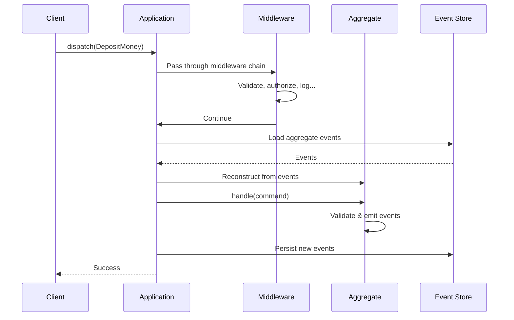
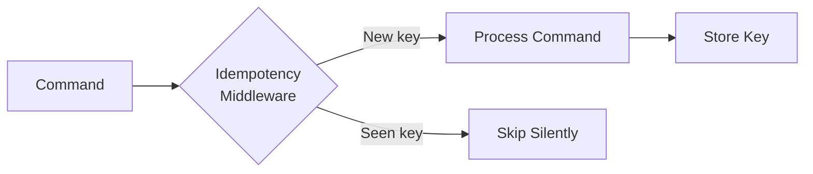

# Commands

A **command** is a message that expresses an intent to perform an action. Commands are the entry point for all state changes in a CQRS system—they represent what a user or system *wants* to happen.

## Commands vs Direct Mutation

In traditional applications, we often mutate state directly:

```python
# Direct mutation - hard to track, audit, or intercept
account.balance += 100
account.save()
```

With commands, we express **intent**:

```python
# Command - declarative, interceptable, auditable
await app.dispatch(DepositMoney(
    aggregate_id=account_id,
    amount=100
))
```

This indirection enables:

- **Validation** before changes occur
- **Authorization** checks via middleware
- **Audit trails** of all attempted operations
- **Retry logic** for failed operations
- **Async processing** and queuing

## Defining Commands

Commands in Interlock extend the `Command` base class:

```python
from interlock.domain import Command
from ulid import ULID

class DepositMoney(Command):
    """Deposit money into a bank account."""
    amount: int

class WithdrawMoney(Command):
    """Withdraw money from a bank account."""
    amount: int

class TransferMoney(Command):
    """Transfer money between accounts."""
    to_account_id: ULID
    amount: int
```

### Required Fields

Every command automatically includes these fields:

| Field | Type | Description |
|-------|------|-------------|
| `aggregate_id` | `ULID` | Target aggregate for this command |
| `command_id` | `ULID` | Unique identifier (auto-generated) |
| `correlation_id` | `ULID \| None` | Links related operations |
| `causation_id` | `ULID \| None` | What triggered this command |

The `aggregate_id` is **required** when creating a command—it identifies which aggregate should handle it:

```python
# aggregate_id is required
command = DepositMoney(
    aggregate_id=ULID(),  # Which account to deposit to
    amount=100
)

# command_id is auto-generated
print(command.command_id)  # 01HXYZ...
```

## Naming Conventions

Commands should be named in the **imperative mood**—they're instructions:

| ✓ Good (Imperative) | ✗ Bad |
|---------------------|-------|
| `CreateAccount` | `AccountCreation` |
| `DepositMoney` | `MoneyDeposited` |
| `CancelOrder` | `OrderCancellation` |
| `SendInvitation` | `InvitationSent` |

The imperative form makes intent clear: this is something we want to *do*, not something that *happened* (that's an event).

## Commands vs Events

Commands and events are both messages, but serve different purposes:

| Aspect | Commands | Events |
|--------|----------|--------|
| **Tense** | Imperative (do this) | Past tense (this happened) |
| **Intent** | Request a change | Record a fact |
| **Outcome** | May succeed or fail | Already happened |
| **Handlers** | Exactly one | Zero or many |
| **Mutability** | Can be rejected/modified | Immutable forever |

```python
# Command - a request that might fail
class WithdrawMoney(Command):
    amount: int

# Event - a fact that happened
class MoneyWithdrawn(BaseModel):
    amount: int
```

## Dispatching Commands

Send commands through the application:

```python
from interlock.application import ApplicationBuilder

app = (
    ApplicationBuilder()
    .register_aggregate(BankAccount)
    .build()
)

async with app:
    # Dispatch a command
    await app.dispatch(DepositMoney(
        aggregate_id=account_id,
        amount=100
    ))
```

### What Happens During Dispatch



## Validation

Commands can fail validation at multiple levels:

### 1. Schema Validation (Pydantic)

Type and constraint validation happens automatically:

```python
class DepositMoney(Command):
    amount: int = Field(gt=0)  # Must be positive

# This raises ValidationError before dispatch
DepositMoney(aggregate_id=ULID(), amount=-100)
```

### 2. Middleware Validation

Cross-cutting validation in middleware:

```python
class FraudDetectionMiddleware(CommandMiddleware):
    @intercepts
    async def check_large_deposits(
        self, 
        command: DepositMoney, 
        next: CommandHandler
    ) -> None:
        if command.amount > 10000:
            await self.fraud_service.flag_for_review(command)
        await next(command)
```

### 3. Domain Validation

Business rules enforced by the aggregate:

```python
@handles_command
async def withdraw(self, command: WithdrawMoney) -> None:
    if command.amount > self.balance:
        raise InsufficientFundsError()
    self.emit(MoneyWithdrawn(amount=command.amount))
```

## Command Routing

Interlock routes commands to aggregates through a two-step process:

1. **Find the aggregate type**: Based on which aggregate has a handler for this command type
2. **Load the aggregate instance**: Using the `aggregate_id` from the command

```python
class BankAccount(Aggregate):
    @handles_command
    async def deposit(self, command: DepositMoney) -> None:
        # This handler tells Interlock that DepositMoney
        # should be routed to BankAccount
        ...
```

### Multiple Aggregates

Different commands route to different aggregates:

```python
class BankAccount(Aggregate):
    @handles_command
    async def deposit(self, command: DepositMoney) -> None: ...

class CreditCard(Aggregate):
    @handles_command
    async def charge(self, command: ChargeCreditCard) -> None: ...

# Commands route to the correct aggregate
await app.dispatch(DepositMoney(...))      # → BankAccount
await app.dispatch(ChargeCreditCard(...))  # → CreditCard
```

## Correlation and Causation

Commands support distributed tracing through correlation and causation IDs:

```python
# Initial command from user action
initial_command = CreateOrder(
    aggregate_id=order_id,
    items=[...],
    correlation_id=ULID()  # Start of the trace
)

# Later, a saga dispatches a related command
await command_bus.dispatch(ChargePayment(
    aggregate_id=payment_id,
    amount=order.total,
    correlation_id=initial_command.correlation_id,  # Same trace
    causation_id=initial_command.command_id  # What caused this
))
```

This enables:

- **Tracing**: Follow a logical operation across services
- **Debugging**: Understand causal chains when things go wrong
- **Auditing**: See exactly what triggered what

## Idempotency

In distributed systems, commands can be delivered more than once due to:

- Network retries
- Message queue redelivery
- Client-side retry logic
- Load balancer failovers

Without idempotency protection, a `DepositMoney` command retried twice could double the deposit. Interlock provides built-in idempotency support through middleware and pluggable storage backends.

### Idempotency Keys

To enable idempotency tracking, extend `IdempotencyTrackedCommand` instead of `Command`:

```python
from interlock.application.commands import IdempotencyTrackedCommand

class DepositMoney(IdempotencyTrackedCommand):
    """A deposit that can only be processed once."""
    amount: int

# Create with an idempotency key
command = DepositMoney(
    aggregate_id=account_id,
    amount=100,
    idempotency_key="deposit-abc-123"  # Client-provided key
)
```

The `idempotency_key` is a string that uniquely identifies this logical operation. Common strategies:

| Strategy | Example | Use When |
|----------|---------|----------|
| **Request ID** | `"req-a1b2c3"` | Each API request has a unique ID |
| **Transaction reference** | `"txn-20240115-001"` | External systems provide references |
| **Content hash** | `hash(user_id + amount + date)` | Dedupe based on operation content |
| **UUID from client** | `str(uuid4())` | Client generates before submission |

### IdempotencyMiddleware

The `IdempotencyMiddleware` intercepts commands and checks if they've been processed:



```python
from interlock.application import ApplicationBuilder
from interlock.application.commands import (
    IdempotencyMiddleware,
    IdempotencyStorageBackend,
)

app = (
    ApplicationBuilder()
    .register_aggregate(BankAccount)
    .register_dependency(
        IdempotencyStorageBackend,
        IdempotencyStorageBackend.in_memory  # Or a persistent backend
    )
    .register_middleware(IdempotencyMiddleware)
    .build()
)
```

When a command with a previously-seen `idempotency_key` arrives, the middleware:

1. Detects the duplicate
2. Logs a warning
3. Returns successfully (without processing)

### Storage Backends

The `IdempotencyStorageBackend` interface is pluggable. Interlock provides:

- **`IdempotencyStorageBackend.in_memory()`** — For testing and development
- **`IdempotencyStorageBackend.null()`** — Disables idempotency (always processes)

For production, you'll want a persistent backend. See the [Database Integrations](../guides/database-integrations.md) guide for available implementations.

### Failure Handling

The middleware stores the key **after** successful processing:

```python
# Pseudocode of middleware behavior
async def ensure_idempotency(self, command, next):
    if await backend.has_processed_command(command):
        return  # Skip duplicate
    
    await next(command)  # Process (may raise)
    
    # Only stored if processing succeeded
    await backend.store_processed_command(command)
```

This means:

- ✓ If processing fails, the key is NOT stored → retry is allowed
- ✓ If processing succeeds, the key IS stored → retries are blocked
- ⚠️ If storage fails after processing, you may get a duplicate on retry

### Commands Without Idempotency

Regular `Command` subclasses bypass idempotency checking entirely:

```python
# Not tracked - each dispatch is processed
class DepositMoney(Command):
    amount: int

await app.dispatch(DepositMoney(aggregate_id=id, amount=100))
await app.dispatch(DepositMoney(aggregate_id=id, amount=100))
# Both deposits are processed - balance increases by 200
```

Use `IdempotencyTrackedCommand` when:

- Commands arrive via unreliable transports (webhooks, queues)
- Clients may retry on timeout
- The operation should only happen once per logical request

## Best Practices

### Be Specific

Prefer specific commands over generic ones:

```python
# Too generic - loses intent
class UpdateAccount(Command):
    changes: dict

# Specific - clear intent
class ChangeAccountEmail(Command):
    new_email: str

class CloseAccount(Command):
    reason: str
```

### Include Necessary Context

Commands should carry all information needed to process them:

```python
# Missing context - handler needs to look up user
class ApproveOrder(Command):
    pass  # Who approved it? When?

# Complete context
class ApproveOrder(Command):
    approved_by: ULID
    approval_notes: str | None = None
```

### Don't Include Derived Data

Let the domain compute derived values:

```python
# Wrong - client computed the new balance
class DepositMoney(Command):
    amount: int
    new_balance: int  # ❌ Don't trust client calculations

# Right - aggregate computes the new balance
class DepositMoney(Command):
    amount: int  # ✓ Just the deposit amount
```

## Further Reading

- [Tutorial: Commands & Handlers](../tutorial/02-commands-and-handlers.md) — Hands-on guide
- [Aggregates](aggregates.md) — Where commands are handled
- [Events](events.md) — What commands produce
- [Custom Middleware](../guides/custom-middleware.md) — Intercepting commands
