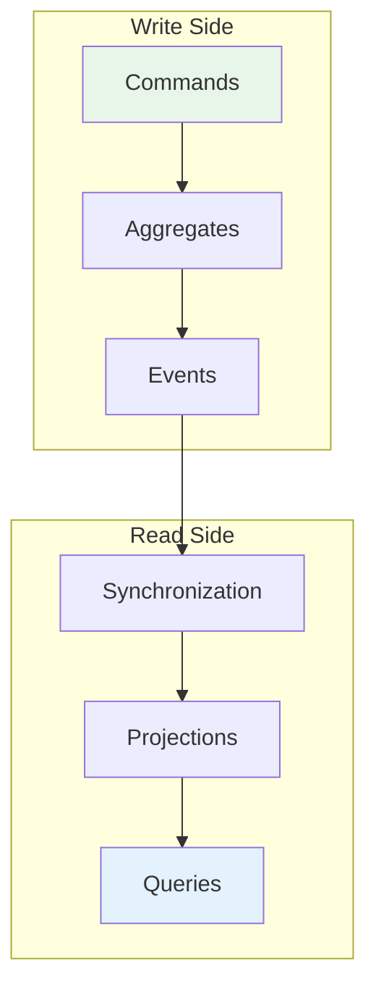
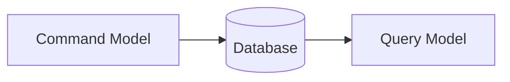
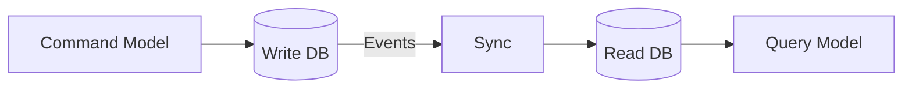

# CQRS

**Command Query Responsibility Segregation** (CQRS) is a pattern that uses different models for reading and writing information. First described by [Greg Young](https://cqrs.files.wordpress.com/2010/11/cqrs_documents.pdf) and popularized in the Domain-Driven Design community, CQRS can be valuable for complex domains—but it adds significant complexity that isn't warranted for most systems.

!!! tip "Further Reading"
    For an in-depth treatment of CQRS, see [Martin Fowler's article on CQRS](https://martinfowler.com/bliki/CQRS.html).

## Beyond CRUD

The mainstream approach for interacting with an information system is to treat it as a CRUD datastore—**Create**, **Read**, **Update**, **Delete**. We have a mental model of records that we manipulate directly:

```python
# Traditional CRUD approach
class AccountRepository:
    def create(self, account: Account) -> None: ...
    def read(self, id: str) -> Account: ...
    def update(self, account: Account) -> None: ...
    def delete(self, id: str) -> None: ...
```

This works well for simple applications. But as systems grow sophisticated, tensions emerge:

- **Multiple representations**: Users see data through various presentations—dashboards, reports, detail views—each requiring different shapes of data
- **Complex updates**: Validation rules, derived data, and business logic make writes far more nuanced than simple record updates
- **Different optimization needs**: Reads often benefit from denormalization and caching, while writes need consistency guarantees

The traditional approach forces a single conceptual model to serve both purposes. This model becomes a compromise that does neither well.

## The Core Idea

CQRS splits the conceptual model into separate models for **commands** (updates) and **queries** (reads):



### Write Side (Command Model)

The command model handles all state changes:

- **Commands** express intent: `DepositMoney`, `TransferFunds`, `CloseAccount`
- **Aggregates** enforce business rules and emit events
- **Events** record what happened

This side is optimized for consistency and business logic.

### Read Side (Query Model)

The query model serves reads:

- **Projections** build read-optimized views from events
- **Queries** return data shaped for specific use cases
- Multiple projections can serve different needs

This side is optimized for query performance and flexibility.

## Variations

CQRS allows considerable variation in implementation:

### Shared Database

The simplest form—both models read from the same database, but use different object models:



The command model writes; the query model reads with optimized queries or views.

### Separate Databases

For higher performance or scale, the models can use separate databases:



This enables:

- Independent scaling of read and write workloads
- Read replicas optimized for specific query patterns
- Geographic distribution

The trade-off is **eventual consistency**—the read model lags slightly behind the write model.

## Natural Companions

CQRS fits naturally with several architectural patterns:

### Event Sourcing

CQRS and [Event Sourcing](event-sourcing.md) are **separate but complementary patterns**:

| Pattern | Core Idea |
|---------|-----------|
| **CQRS** | Separate models for reads and writes |
| **Event Sourcing** | Store state as a sequence of events |

You can use either pattern independently—CQRS without Event Sourcing, or Event Sourcing without CQRS. However, they work exceptionally well together:

- Event Sourcing provides the events that update read models
- Events flow naturally from write side to read side
- The event log becomes the synchronization mechanism
- Rebuilding projections is as simple as replaying events

!!! info "Interlock's Approach"
    Interlock combines both patterns to help you build robust applications. The write side uses Event Sourcing (aggregates emit events, state is reconstructed from event history), while the read side uses Event Processors to build projections—a natural CQRS architecture. This gives you the benefits of both patterns with a cohesive programming model.

### Task-Based UIs

Moving away from CRUD encourages task-based interfaces:

```python
# CRUD-style (generic)
account.balance = account.balance + 100
account.save()

# Task-based (intent-revealing)
await app.dispatch(DepositMoney(
    aggregate_id=account_id,
    amount=100,
    source="ATM-1234"
))
```

Task-based UIs capture user intent, enabling richer business logic and better audit trails.

### Eventual Consistency

With separate models, you must decide how consistent they need to be:

- **Strong consistency**: Slower, but reads always reflect latest writes
- **Eventual consistency**: Faster, but reads may be slightly stale

Most CQRS systems embrace eventual consistency on the read side, since many use cases tolerate minor staleness.

## When to Use CQRS

!!! warning "Use With Caution"
    CQRS is a significant mental leap for all concerned. Most systems fit a CRUD mental model and should be built that way. CQRS adds complexity that can reduce productivity and increase risk if misapplied.

### Good Fit

CQRS provides benefits when:

| Scenario | Why CQRS Helps |
|----------|----------------|
| **Complex domain logic** | Write model focuses purely on business rules |
| **High read/write disparity** | Scale reads and writes independently |
| **Multiple read representations** | Build projections optimized for each view |
| **Collaborative domains** | Handle concurrent modifications gracefully |
| **Audit requirements** | Event-based updates provide complete history |

### Poor Fit

Avoid CQRS when:

- **Simple CRUD suffices**: Most line-of-business applications
- **Team unfamiliarity**: The pattern requires experience to apply well
- **Tight timelines**: Learning curve can impact delivery
- **Read/write similarity**: When the same model works for both

### Bounded Contexts

CQRS should apply to **specific portions** of a system, not the whole thing. In Domain-Driven Design terms, each Bounded Context makes its own modeling decisions:

```
┌─────────────────────────────────────────────────────┐
│                    Application                       │
│                                                     │
│  ┌─────────────────┐    ┌─────────────────────────┐ │
│  │   Accounting    │    │      Reporting          │ │
│  │     (CQRS)      │    │       (CRUD)            │ │
│  │                 │    │                         │ │
│  │ Complex domain  │    │ Simple queries,         │ │
│  │ Audit needs     │    │ no business logic       │ │
│  └─────────────────┘    └─────────────────────────┘ │
│                                                     │
│  ┌─────────────────┐    ┌─────────────────────────┐ │
│  │  Notifications  │    │    User Management      │ │
│  │     (Events)    │    │        (CRUD)           │ │
│  └─────────────────┘    └─────────────────────────┘ │
└─────────────────────────────────────────────────────┘
```

## CQRS in Interlock

Interlock provides the building blocks for CQRS applications:

### Write Side

```python
from interlock.domain import Aggregate, Command, Event
from interlock.routing import handles_command, applies_event

class DepositMoney(Command):
    amount: int

class MoneyDeposited(Event):
    amount: int

class BankAccount(Aggregate):
    balance: int = 0

    @handles_command
    async def deposit(self, command: DepositMoney) -> None:
        if command.amount <= 0:
            raise ValueError("Amount must be positive")
        self.emit(MoneyDeposited(amount=command.amount))

    @applies_event
    def apply_deposit(self, event: MoneyDeposited) -> None:
        self.balance += event.amount
```

### Read Side

```python
from abc import ABC, abstractmethod
from interlock.application import Projection
from interlock.domain import Query
from interlock.routing import handles_event, handles_query

# Define repository interface (allows swapping storage backends)
class BalanceRepository(ABC):
    @abstractmethod
    async def get(self, account_id: ULID) -> int: ...
    
    @abstractmethod
    async def save(self, account_id: ULID, balance: int) -> None: ...

# Query with typed response
class GetAccountBalance(Query[int]):
    account_id: ULID

# Projection with injected repository
class AccountBalanceProjection(Projection):
    def __init__(self, repository: BalanceRepository):
        super().__init__()
        self.repository = repository

    @handles_event
    async def on_deposit(self, event: MoneyDeposited) -> None:
        current = await self.repository.get(event.aggregate_id)
        await self.repository.save(
            event.aggregate_id, 
            current + event.amount
        )
    
    @handles_query
    async def get_balance(self, query: GetAccountBalance) -> int:
        return await self.repository.get(query.account_id)
```

### Flexibility

Interlock is opinionated about the write side (commands, aggregates, events) but 
flexible about the read side:

- Use `Projection` for read models with typed queries
- Use `EventProcessor` for side effects (notifications, integrations)
- Inject any database or storage via dependency injection
- Mix synchronous and eventually-consistent reads

## Summary

CQRS separates your application into command and query models, enabling each to be optimized for its purpose. It's a powerful pattern for complex domains with demanding requirements—but most systems don't need it.

**Key takeaways:**

- CQRS splits conceptual models, not just data access
- Use it for specific bounded contexts, not entire applications  
- Pairs naturally with Event Sourcing and eventual consistency
- Adds complexity—ensure the benefits justify the cost

Start with a simpler architecture. Introduce CQRS when you encounter the specific problems it solves.
