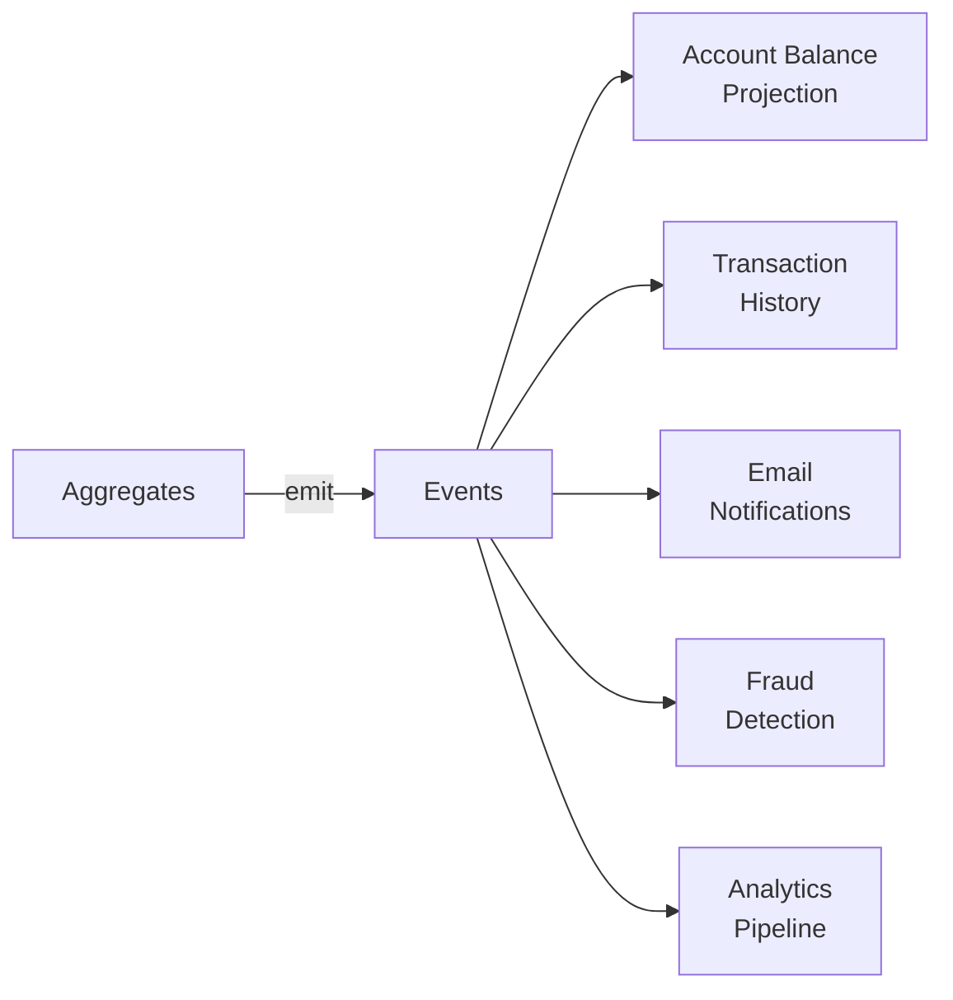
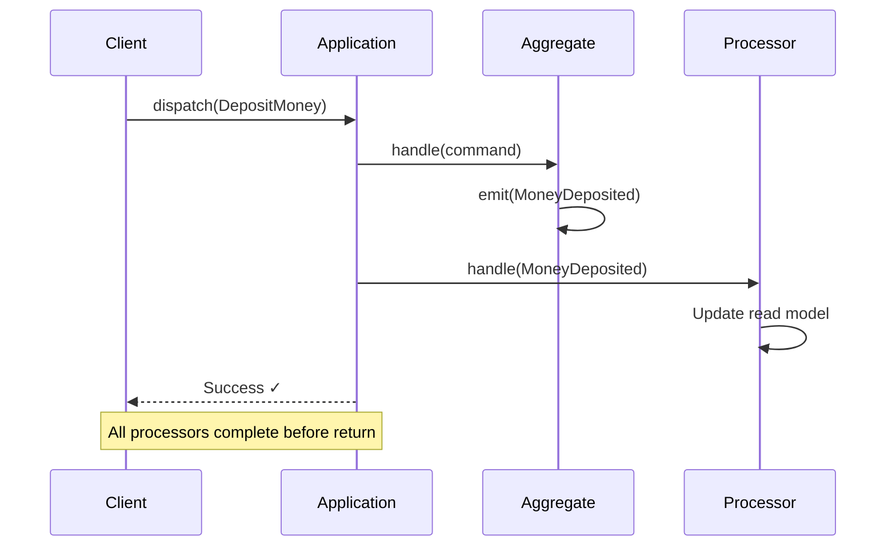
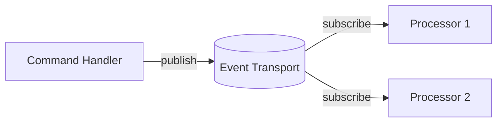
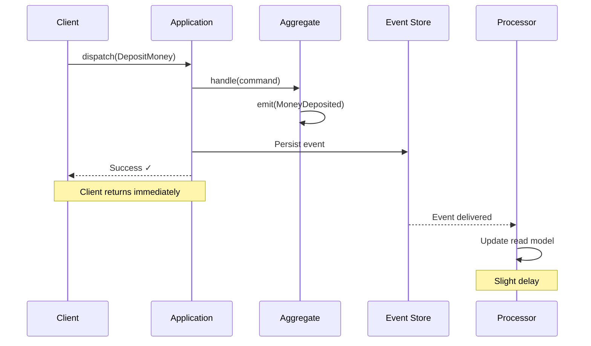

# Event Processors

**Event processors** subscribe to events and execute logic in response. They're the "read side" of [CQRS](cqrs.md)—building optimized views, triggering notifications, and coordinating workflows.

## Why Event Processors?

In an event-sourced system, aggregates emit events when state changes. But those events have value beyond just rebuilding aggregate state:



Event processors consume these events to:

- **Build read models**: Denormalized views optimized for queries
- **Send notifications**: Emails, SMS, push notifications
- **Integrate systems**: Call external APIs and services
- **Coordinate workflows**: Multi-step business processes (sagas)
- **Update analytics**: Metrics, dashboards, data warehouses

## Defining Event Processors

Event processors extend the `EventProcessor` base class and use `@handles_event` to subscribe to events:

```python
from interlock.application.events import EventProcessor
from interlock.routing import handles_event

class AccountBalanceProjection(EventProcessor):
    """Maintains a read-optimized view of account balances."""

    def __init__(self, repository: BalanceRepository):
        self.repository = repository

    @handles_event
    async def on_account_opened(self, event: AccountOpened) -> None:
        await self.repository.create(
            account_id=event.aggregate_id,
            owner=event.owner_name,
            balance=event.initial_deposit
        )

    @handles_event
    async def on_money_deposited(self, event: MoneyDeposited) -> None:
        await self.repository.increment(
            event.aggregate_id, 
            event.amount
        )

    @handles_event
    async def on_money_withdrawn(self, event: MoneyWithdrawn) -> None:
        await self.repository.decrement(
            event.aggregate_id, 
            event.amount
        )
```

### Handler Discovery

Like aggregates, handlers are discovered through:

1. The `@handles_event` decorator
2. The type annotation on the event parameter

```python
# Both work identically
@handles_event
async def on_deposit(self, event: MoneyDeposited) -> None: ...

@handles_event
async def handle_money_deposited(self, event: MoneyDeposited) -> None: ...
```

## Common Use Cases

### Projections (Read Models)

Build views optimized for specific queries:

```python
class CustomerDashboardProjection(EventProcessor):
    """Builds a denormalized view for the customer dashboard."""

    @handles_event
    async def on_order_placed(self, event: OrderPlaced) -> None:
        await self.db.upsert(
            "customer_dashboard",
            customer_id=event.customer_id,
            update={
                "$inc": {"total_orders": 1, "total_spent": event.amount},
                "$set": {"last_order_date": event.timestamp}
            }
        )
```

### Notifications

Trigger communications based on events:

```python
class OrderNotificationProcessor(EventProcessor):
    def __init__(self, email_service: EmailService):
        self.email_service = email_service

    @handles_event
    async def on_order_shipped(self, event: OrderShipped) -> None:
        await self.email_service.send(
            to=event.customer_email,
            template="order_shipped",
            data={"tracking_number": event.tracking_number}
        )
```

### Integration

Sync with external systems:

```python
class SearchIndexProcessor(EventProcessor):
    def __init__(self, search_client: SearchClient):
        self.search_client = search_client

    @handles_event
    async def on_product_created(self, event: ProductCreated) -> None:
        await self.search_client.index({
            "id": event.product_id,
            "name": event.name,
            "description": event.description,
            "category": event.category
        })

    @handles_event
    async def on_product_deleted(self, event: ProductDeleted) -> None:
        await self.search_client.delete(event.product_id)
```

### Analytics

Feed data pipelines:

```python
class TransactionMetricsProcessor(EventProcessor):
    def __init__(self, metrics: MetricsClient):
        self.metrics = metrics

    @handles_event
    async def on_money_deposited(self, event: MoneyDeposited) -> None:
        self.metrics.increment("deposits.count")
        self.metrics.histogram("deposits.amount", event.amount)

    @handles_event
    async def on_money_withdrawn(self, event: MoneyWithdrawn) -> None:
        self.metrics.increment("withdrawals.count")
        self.metrics.histogram("withdrawals.amount", event.amount)
```

## Registering Processors

Register processors with the application:

```python
from interlock.application import ApplicationBuilder

app = (
    ApplicationBuilder()
    .register_aggregate(BankAccount)
    .register_dependency(BalanceRepository, InMemoryBalanceRepository)
    .register_event_processor(AccountBalanceProjection)
    .register_event_processor(TransactionMetricsProcessor)
    .build()
)
```

Or use convention-based discovery:

```python
app = (
    ApplicationBuilder()
    .convention_based("my_app")  # Discovers processors in my_app/
    .build()
)
```

## Running Processors

Interlock supports two delivery strategies that determine when and how processors execute:

### Synchronous Delivery (Default)

With synchronous delivery, processors execute **immediately** during command handling:



Characteristics:

- **Immediate consistency**: Read models update before command returns
- **Simple deployment**: Single process, no message broker needed
- **Coupled failures**: Processor errors fail the command
- **Higher latency**: Command waits for all processors

This is the default because it's simplest for getting started. No additional configuration needed.

### Asynchronous Delivery

With asynchronous delivery, processors run **separately** from command handling:

```python
from interlock.application import ApplicationBuilder
from interlock.application.events import AsynchronousDelivery, EventDelivery

app = (
    ApplicationBuilder()
    .register_dependency(EventDelivery, AsynchronousDelivery)
    .register_aggregate(BankAccount)
    .register_event_processor(AccountBalanceProjection)
    .build()
)
```

Then run processors explicitly:

```python
async with app:
    # Start processors in background tasks
    await app.run_event_processors(
        AccountBalanceProjection,
        TransactionMetricsProcessor,
    )
```

Characteristics:

- **Eventual consistency**: Read models update after command returns
- **Scalable**: Processors can run in separate containers
- **Decoupled failures**: Processor errors don't affect commands
- **Lower latency**: Command returns immediately after persistence

#### Event Transports

Asynchronous delivery requires an `EventTransport` to move events from producers to consumers. Interlock provides:

- **`InMemoryEventTransport`** — For testing and single-process async (default)
- **Kafka, Redis, etc.** — For distributed production deployments

The transport determines how events flow between the command side and processor side:



For production systems, you'll typically use a durable message broker. See the [Database Integrations](../guides/database-integrations.md) guide for available transport implementations.

### Choosing a Strategy

| Consideration | Synchronous | Asynchronous |
|---------------|-------------|--------------|
| **Consistency** | Immediate | Eventual |
| **Deployment** | Single process | Can distribute |
| **Command latency** | Higher (includes processors) | Lower (just persistence) |
| **Failure isolation** | Coupled | Isolated |
| **Complexity** | Simple | Requires infrastructure |

**Recommendations:**

- **Development/prototyping**: Start with synchronous (default)
- **Production monolith**: Synchronous often sufficient
- **Microservices**: Asynchronous with external transport (Kafka, etc.)
- **High throughput**: Asynchronous to minimize command latency

## Eventual Consistency

With asynchronous delivery, processors run independently from command handling:



The read model may lag slightly behind writes. Design your UI to handle this:

- Show optimistic updates
- Display "processing" states
- Refresh after short delays

## Idempotency

Events may be delivered more than once. Make handlers idempotent:

```python
@handles_event
async def on_order_placed(self, event: OrderPlaced) -> None:
    # Idempotent - upsert instead of insert
    await self.db.upsert(
        "orders",
        {"order_id": event.order_id},  # Unique key
        {"$set": {"status": "placed", "items": event.items}}
    )
```

Interlock provides `IdempotencyStorageBackend` for tracking processed events.

## Error Handling

When a processor fails:

1. The event is not acknowledged
2. Delivery is retried (based on configuration)
3. After max retries, the event goes to a dead-letter queue

```python
class ResilientProcessor(EventProcessor):
    @handles_event
    async def on_order_placed(self, event: OrderPlaced) -> None:
        try:
            await self.external_api.notify(event)
        except TemporaryError:
            # Raising an exception triggers retry
            raise
        except PermanentError:
            # Log and continue - don't block the stream
            logger.error(f"Failed to process {event}", exc_info=True)
```

## Testing Processors

Use `ProcessorScenario` for behavior-driven testing:

```python
import pytest
from interlock.application import ApplicationBuilder

@pytest.fixture
def app():
    repository = InMemoryBalanceRepository()
    return (
        ApplicationBuilder()
        .register_dependency(BalanceRepository, lambda: repository)
        .register_event_processor(AccountBalanceProjection)
        .build()
    )

async def test_tracks_balance_after_deposit(app):
    account_id = ULID()
    
    async with app.processor_scenario(AccountBalanceProjection) as scenario:
        await scenario \
            .given(MoneyDeposited(amount=100)) \
            .should_have_state(
                lambda p: p.repository.get_balance(account_id) == 100
            )
```

## Processor vs Saga

Both process events, but serve different purposes:

| Aspect | Event Processor | Saga |
|--------|-----------------|------|
| **State** | Stateless or projection-only | Maintains workflow state |
| **Purpose** | Read models, side effects | Multi-step coordination |
| **Commands** | Rarely dispatches commands | Orchestrates via commands |
| **Idempotency** | Handle yourself | Built-in step tracking |

Use processors for:

- Building read models
- One-shot side effects (notifications)
- Analytics and metrics

Use [Sagas](../guides/sagas.md) for:

- Multi-aggregate transactions
- Long-running workflows
- Compensation on failure

## Best Practices

### Single Responsibility

One processor, one purpose:

```python
# Good - focused processors
class AccountBalanceProjection(EventProcessor): ...
class TransactionHistoryProjection(EventProcessor): ...
class NotificationProcessor(EventProcessor): ...

# Avoid - kitchen sink processor
class EverythingProcessor(EventProcessor):
    # Builds projections AND sends emails AND updates metrics...
```

### Handle All Relevant Events

Don't miss events that affect your projection:

```python
class BalanceProjection(EventProcessor):
    @handles_event
    async def on_opened(self, event: AccountOpened) -> None: ...
    
    @handles_event
    async def on_deposited(self, event: MoneyDeposited) -> None: ...
    
    @handles_event
    async def on_withdrawn(self, event: MoneyWithdrawn) -> None: ...
    
    @handles_event
    async def on_closed(self, event: AccountClosed) -> None: ...
    # Don't forget account closure!
```

### Design for Replay

Processors may need to rebuild from scratch:

- Make handlers idempotent
- Don't rely on external state ordering
- Consider tombstone/delete events

## Further Reading

- [Tutorial: Event Processors](../tutorial/04-event-processors.md) — Hands-on guide
- [CQRS](cqrs.md) — The pattern processors implement
- [Sagas Guide](../guides/sagas.md) — Stateful event coordination
- [Writing Tests](../guides/writing-tests.md) — Testing strategies
