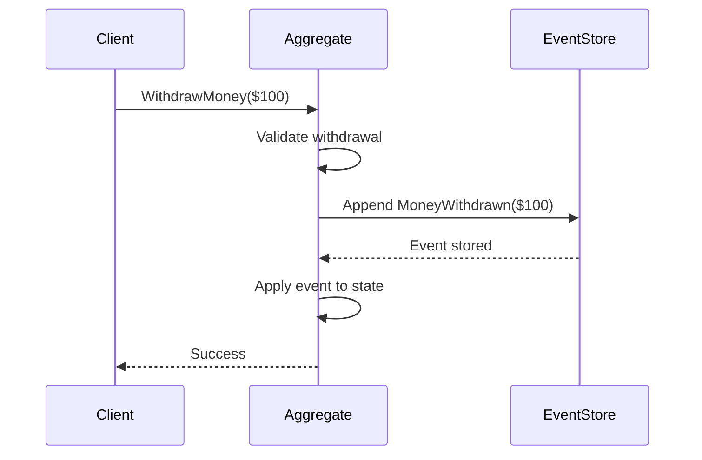
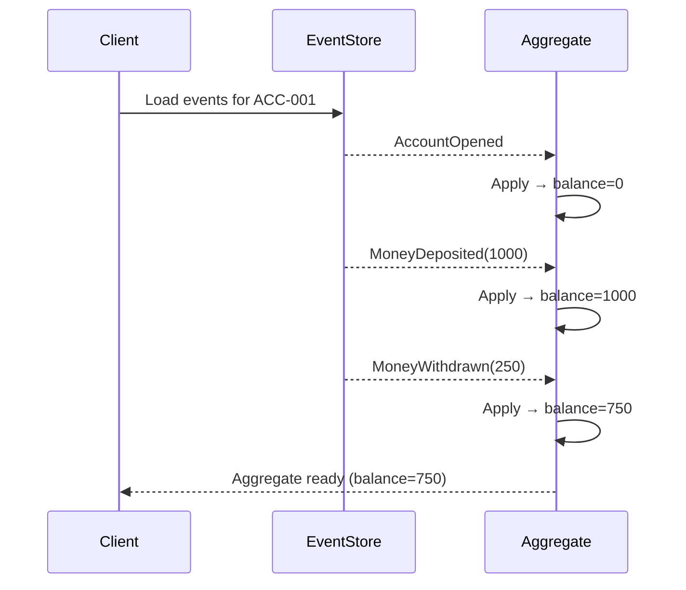

# Event Sourcing

**Event Sourcing** ensures that all changes to application state are captured as 
a sequence of events. Rather than storing just the current state, you store the 
complete history of how that state came to be.

!!! quote "Martin Fowler"
    "The fundamental idea of Event Sourcing is that of ensuring every change to 
    the state of an application is captured in an event object, and that these 
    event objects are themselves stored in the sequence they were applied for 
    the same lifetime as the application state itself."
    
    — [Event Sourcing](https://martinfowler.com/eaaDev/EventSourcing.html)

## The Core Idea

We can always query an application to find its current state. But sometimes we 
need more than that—we need to know *how we got there*.

Consider a bank account. With traditional storage, we might see:

```
Account: ACC-001
Balance: $750
```

But how did we arrive at $750? Was it a $1000 deposit followed by a $250 
withdrawal? Or $500 deposited twice with a $250 fee? The current state doesn't 
tell us.

With Event Sourcing, we store the sequence of events:

```
1. AccountOpened(id="ACC-001", owner="Alice")
2. MoneyDeposited(amount=1000)
3. MoneyWithdrawn(amount=250)
```

The current balance is *derived* by replaying these events: `0 + 1000 - 250 = 750`.

## How It Works

When something changes in your domain, instead of directly mutating state, you:

1. **Create an event** describing what happened
2. **Store the event** in an append-only log
3. **Apply the event** to update the in-memory state



To load an aggregate, you replay its events from the store:



## What This Enables

Storing events rather than state unlocks powerful capabilities:

### Complete Rebuild

You can discard the current application state entirely and rebuild it by 
replaying all events. This is invaluable for:

- Fixing bugs in state calculation
- Migrating to new data structures
- Testing state reconstruction logic

### Temporal Queries

You can determine the application state **at any point in time** by replaying 
events up to that moment:

```python
# What was the balance on January 15th?
events = event_store.load(account_id, up_to=datetime(2024, 1, 15))
state = replay(events)
print(state.balance)  # Balance as of Jan 15
```

### Event Replay for Corrections

If you discover a past event was incorrect, you can:

1. Reverse the effects of that event and all subsequent events
2. Apply the corrected event
3. Replay subsequent events

This handles scenarios like:
- Retroactive corrections ("this deposit was actually $500, not $50")
- Events received out of order (common in distributed systems)

### Audit Trail

Every change is recorded with full context—who, what, when. This is essential 
for regulated industries (finance, healthcare) where you must prove what 
happened and when.

### Multiple Projections

The same event stream can feed multiple read models optimized for different 
queries. A `MoneyDeposited` event might update:

- An account balance projection
- A daily transaction summary
- A fraud detection system
- A customer notification service

## The Event Store

The event store is an append-only log of events, typically organized by 
aggregate ID:

```
Aggregate: ACC-001
┌─────┬──────────────────────┬─────────────────────────────┐
│ Seq │ Timestamp            │ Event                       │
├─────┼──────────────────────┼─────────────────────────────┤
│ 0   │ 2024-01-01 10:00:00  │ AccountOpened(owner=Alice)  │
│ 1   │ 2024-01-05 14:30:00  │ MoneyDeposited(amount=1000) │
│ 2   │ 2024-01-10 09:15:00  │ MoneyWithdrawn(amount=250)  │
│ 3   │ 2024-01-12 16:45:00  │ MoneyDeposited(amount=500)  │
└─────┴──────────────────────┴─────────────────────────────┘
```

Key properties:

- **Append-only**: Events are never modified or deleted
- **Ordered**: Events have a sequence number within their stream
- **Immutable**: Once stored, events never change

## Performance: Snapshots

Replaying thousands of events on every load is slow. **Snapshots** solve this 
by periodically saving the current state:

```
┌──────────────────────────────────────────────────────────┐
│ Events: [0] [1] [2] [3] [4] [5] [6] [7] [8] [9] [10]... │
│                              ↑                          │
│                         Snapshot at seq 5               │
│                         (balance=$1250)                 │
└──────────────────────────────────────────────────────────┘

To load: Load snapshot → Replay events 6, 7, 8, 9, 10...
```

Snapshots are purely an optimization—you can always rebuild from events if 
needed.

## Challenges

Event Sourcing isn't free. Consider these challenges:

### Event Schema Evolution

Events are immutable, but your domain model evolves. When you need to change 
an event's structure, you need **upcasting** to transform old events to new 
schemas.

See: [Event Upcasting Guide](../guides/event-upcasting.md)

### Eventual Consistency

Read models (projections) are updated asynchronously from the event stream. 
There's a window where a query might return stale data. Your UI and API design 
must account for this.

### Learning Curve

Event Sourcing requires a different mental model. Developers must think in 
terms of "what happened" rather than "what is the current state."

### Storage Growth

Events accumulate forever (that's the point). You need strategies for:

- Archiving old events
- Efficient storage formats
- Snapshot frequency tuning

## Event Sourcing in Interlock

Interlock provides the infrastructure for Event Sourcing:

| Component | Purpose |
|-----------|---------|
| `Aggregate` | Base class with `emit()` for recording events |
| `@applies_event` | Decorator for event handler methods |
| `EventStore` | Abstract interface for event persistence |
| `AggregateSnapshotStorageBackend` | Snapshot storage for performance |
| Event Upcasting | Schema evolution support |

Example aggregate using Event Sourcing:

```python
from interlock.domain import Aggregate
from interlock.routing import handles_command, applies_event

class BankAccount(Aggregate):
    balance: int = 0
    
    @handles_command
    def handle_deposit(self, command: DepositMoney) -> None:
        # Don't mutate directly—emit an event
        self.emit(MoneyDeposited(amount=command.amount))
    
    @applies_event
    def apply_deposited(self, event: MoneyDeposited) -> None:
        # Event handler updates state
        self.balance += event.amount
```

## Event Sourcing and CQRS

Event Sourcing and [CQRS](cqrs.md) are **separate but complementary patterns**:

| Pattern | Core Idea |
|---------|-----------|
| **Event Sourcing** | Store state as a sequence of events |
| **CQRS** | Separate models for reads and writes |

You can use either pattern independently. However, they work exceptionally well together—Event Sourcing naturally produces the events that CQRS read models consume.

!!! info "Interlock's Approach"
    Interlock combines both patterns to help you build robust applications. Aggregates use Event Sourcing (emitting events, reconstructing state from history), while Event Processors build optimized read models—a natural CQRS architecture. This gives you the benefits of both patterns with a cohesive programming model.

## Further Reading

- [Martin Fowler: Event Sourcing](https://martinfowler.com/eaaDev/EventSourcing.html) — 
  In-depth exploration of the pattern
- [Tutorial: Events & Sourcing](../tutorial/03-events-and-sourcing.md) — 
  Hands-on introduction
- [Event Upcasting Guide](../guides/event-upcasting.md) — 
  Handling schema evolution
- [CQRS](cqrs.md) — 
  Command Query Responsibility Segregation
