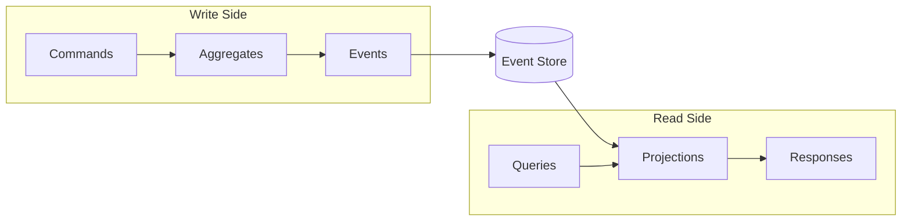

# Concepts

This section provides in-depth explanations of the patterns and principles behind Interlock.

## Core Patterns

-   :material-history:{ .lg .middle } __Event Sourcing__

    ---

    Store state as a sequence of events rather than current values. Enables complete audit trails, temporal queries, and rebuilding state from history.

    [:octicons-arrow-right-24: Learn about Event Sourcing](event-sourcing.md)

-   :material-call-split:{ .lg .middle } __CQRS__

    ---

    Separate read and write models to optimize each for its purpose. Scale reads and writes independently.

    [:octicons-arrow-right-24: Learn about CQRS](cqrs.md)

!!! info "Separate but Complementary"
    Event Sourcing and CQRS are independent patterns that work exceptionally well together. Interlock combines both to give you a cohesive programming model—aggregates use Event Sourcing for the write side, while Event Processors build read models for the query side.

## Building Blocks

-   :material-shape:{ .lg .middle } __Aggregates__

    ---

    Domain objects that maintain consistency boundaries and emit events

    [:octicons-arrow-right-24: Learn about Aggregates](aggregates.md)

-   :material-send:{ .lg .middle } __Commands__

    ---

    Messages that express intent to change state

    [:octicons-arrow-right-24: Learn about Commands](commands.md)

-   :material-magnify:{ .lg .middle } __Queries__

    ---

    Messages that request data without changing state

    [:octicons-arrow-right-24: Learn about Queries](queries.md)

-   :material-lightning-bolt:{ .lg .middle } __Events__

    ---

    Immutable records of things that happened

    [:octicons-arrow-right-24: Learn about Events](events.md)

-   :material-cog-sync:{ .lg .middle } __Event Processors__

    ---

    Components that react to events for side effects and integrations

    [:octicons-arrow-right-24: Learn about Event Processors](event-processors.md)

-   :material-database-search:{ .lg .middle } __Projections__

    ---

    Read models that handle events and serve typed queries

    [:octicons-arrow-right-24: Learn about Projections](projections.md)

## How They Fit Together

1. **Commands** express user intent ("deposit $100")
2. **Aggregates** validate business rules and emit **events**
3. **Events** are persisted to the event store
4. **Projections** consume events to build read models
5. **Queries** request data from projections, which return typed **responses**

## Why These Patterns?

| Benefit | How Interlock Delivers It |
|---------|---------------------------|
| **Complete audit trail** | Every change is recorded as an event |
| **Temporal queries** | Query your system at any point in time |
| **Scalability** | Read and write sides scale independently |
| **Flexibility** | Build multiple read models from the same events |
| **Debugging** | Replay events to understand how state evolved |
| **Resilience** | Rebuild state from events after failures |
