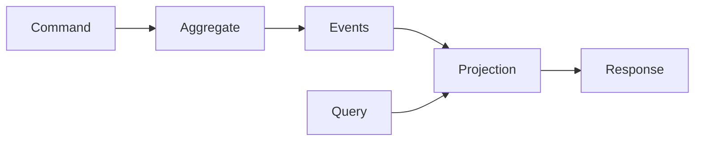

# Projections

A **projection** is a read model that combines event handling with query serving. 
Projections are the read side of CQRS—they build optimized views from events and 
serve typed queries against those views.

## Projections vs Event Processors

While both `EventProcessor` and `Projection` handle events, they serve different 
purposes:

| Aspect | EventProcessor | Projection |
|--------|---------------|------------|
| **Purpose** | React to events | Build and query read models |
| **Event handling** | ✓ | ✓ |
| **Query handling** | ✗ | ✓ |
| **Use case** | Side effects, notifications | Read models, lookups |

A projection *is* an event processor (it extends `EventProcessor`), but adds 
the ability to handle queries.

## Projections vs Aggregates

Projections are the read-side counterpart to aggregates:

| Aspect | Aggregates | Projections |
|--------|------------|-------------|
| **Handles** | Commands | Queries |
| **Purpose** | Enforce invariants, emit events | Build views, serve reads |
| **State** | Event-sourced, authoritative | Derived, eventually consistent |
| **Updates** | Receives commands | Receives events |



## Defining Projections

Projections extend `Projection` and use two decorators:

- `@handles_event` — Methods that process events to update state
- `@handles_query` — Methods that serve queries against the state

```python
from interlock.application import Projection
from interlock.domain import Query
from interlock.routing import handles_event, handles_query
from pydantic import BaseModel
from ulid import ULID

# Response type
class UserProfile(BaseModel):
    id: ULID
    name: str
    email: str

# Query types (see Queries documentation for details)
class GetUserById(Query[UserProfile]):
    user_id: ULID

class GetUserByEmail(Query[ULID | None]):
    email: str

class CountUsers(Query[int]):
    pass

# Projection that builds a user directory
class UserDirectoryProjection(Projection):
    def __init__(self):
        super().__init__()
        self.users: dict[ULID, UserProfile] = {}
        self.email_index: dict[str, ULID] = {}
    
    # Event handlers update state
    @handles_event
    async def on_user_created(self, event: UserCreated) -> None:
        profile = UserProfile(
            id=event.user_id,
            name=event.name,
            email=event.email
        )
        self.users[event.user_id] = profile
        self.email_index[event.email] = event.user_id
    
    @handles_event
    async def on_email_changed(self, event: EmailChanged) -> None:
        user = self.users.get(event.user_id)
        if user:
            del self.email_index[user.email]
            user.email = event.new_email
            self.email_index[event.new_email] = event.user_id
    
    # Query handlers serve reads
    @handles_query
    async def get_by_id(self, query: GetUserById) -> UserProfile:
        return self.users[query.user_id]
    
    @handles_query
    async def get_by_email(self, query: GetUserByEmail) -> ULID | None:
        return self.email_index.get(query.email)
    
    @handles_query
    async def count(self, query: CountUsers) -> int:
        return len(self.users)
```

## Registering Projections

Register projections with the application builder:

```python
from interlock.application import ApplicationBuilder

app = (
    ApplicationBuilder()
    .register_projection(UserDirectoryProjection)
    .register_projection(OrderHistoryProjection)
    .build()
)
```

Each query type can only be handled by one projection—the framework uses the 
query type to route to the correct projection.

## Dispatching Queries

See [Queries](queries.md) for complete details. The short version:

```python
async with app:
    # Queries are dispatched through app.query()
    user = await app.query(GetUserById(user_id=user_id))
    print(user.name)
    
    # Queries pass through middleware
    count = await app.query(CountUsers())
    print(f"Total users: {count}")
```

## Middleware with Projections

Middleware can intercept queries just like commands. Use the `Query` base type 
to intercept all queries:

```python
from interlock.application.middleware import Middleware, Handler
from interlock.domain import Query
from interlock.routing import intercepts

class QueryLoggingMiddleware(Middleware):
    @intercepts
    async def log_query(self, query: Query, next: Handler):
        print(f"Query: {type(query).__name__}")
        result = await next(query)
        print(f"Result: {result}")
        return result

class CachingMiddleware(Middleware):
    def __init__(self):
        self.cache = {}
    
    @intercepts
    async def cache_queries(self, query: Query, next: Handler):
        key = f"{type(query).__name__}:{query.model_dump_json()}"
        
        if key in self.cache:
            return self.cache[key]
        
        result = await next(query)
        self.cache[key] = result
        return result
```

The same middleware instance handles both commands and queries—use type 
annotations to control which messages are intercepted.

## Persistence

Projections are responsible for their own state persistence. The simple examples 
above use in-memory state, which is fine for testing but not production.

### Repository Pattern (Recommended)

The recommended approach is to **define an abstract repository interface** and 
inject it into the projection. This decouples the projection from the storage 
mechanism, allowing you to:

- Swap storage backends without changing projection code
- Use in-memory storage for fast unit tests
- Use different databases in different environments

#### Step 1: Define the Repository Interface

Create an abstract base class that defines the operations your projection needs:

```python
from abc import ABC, abstractmethod
from ulid import ULID

class UserDirectoryRepository(ABC):
    """Abstract interface for user directory storage."""
    
    @abstractmethod
    async def save_user(self, user: UserProfile) -> None:
        """Save or update a user profile."""
        ...
    
    @abstractmethod
    async def get_user(self, user_id: ULID) -> UserProfile | None:
        """Get a user by ID, or None if not found."""
        ...
    
    @abstractmethod
    async def get_user_by_email(self, email: str) -> ULID | None:
        """Look up user ID by email, or None if not found."""
        ...
    
    @abstractmethod
    async def update_email(self, user_id: ULID, new_email: str) -> None:
        """Update a user's email address."""
        ...
    
    @abstractmethod
    async def count_users(self) -> int:
        """Return total number of users."""
        ...
```

#### Step 2: Implement the Interface

Provide implementations for different environments:

```python
# In-memory implementation for testing
class InMemoryUserDirectoryRepository(UserDirectoryRepository):
    def __init__(self):
        self.users: dict[ULID, UserProfile] = {}
        self.email_index: dict[str, ULID] = {}
    
    async def save_user(self, user: UserProfile) -> None:
        self.users[user.id] = user
        self.email_index[user.email] = user.id
    
    async def get_user(self, user_id: ULID) -> UserProfile | None:
        return self.users.get(user_id)
    
    async def get_user_by_email(self, email: str) -> ULID | None:
        return self.email_index.get(email)
    
    async def update_email(self, user_id: ULID, new_email: str) -> None:
        user = self.users.get(user_id)
        if user:
            del self.email_index[user.email]
            user.email = new_email
            self.email_index[new_email] = user_id
    
    async def count_users(self) -> int:
        return len(self.users)


# PostgreSQL implementation for production
class PostgresUserDirectoryRepository(UserDirectoryRepository):
    def __init__(self, connection_pool: asyncpg.Pool):
        self.pool = connection_pool
    
    async def save_user(self, user: UserProfile) -> None:
        async with self.pool.acquire() as conn:
            await conn.execute(
                """
                INSERT INTO user_directory (id, name, email)
                VALUES ($1, $2, $3)
                ON CONFLICT (id) DO UPDATE SET name = $2, email = $3
                """,
                str(user.id), user.name, user.email
            )
    
    async def get_user(self, user_id: ULID) -> UserProfile | None:
        async with self.pool.acquire() as conn:
            row = await conn.fetchrow(
                "SELECT id, name, email FROM user_directory WHERE id = $1",
                str(user_id)
            )
            if row:
                return UserProfile(
                    id=ULID.from_str(row["id"]),
                    name=row["name"],
                    email=row["email"]
                )
            return None
    
    # ... other methods
```

#### Step 3: Inject the Interface

The projection depends on the abstract interface, not a concrete implementation:

```python
class UserDirectoryProjection(Projection):
    def __init__(self, repository: UserDirectoryRepository):  # (1)!
        super().__init__()
        self.repository = repository
    
    @handles_event
    async def on_user_created(self, event: UserCreated) -> None:
        await self.repository.save_user(UserProfile(
            id=event.user_id,
            name=event.name,
            email=event.email
        ))
    
    @handles_event
    async def on_email_changed(self, event: EmailChanged) -> None:
        await self.repository.update_email(event.user_id, event.new_email)
    
    @handles_query
    async def get_by_id(self, query: GetUserById) -> UserProfile:
        user = await self.repository.get_user(query.user_id)
        if not user:
            raise KeyError(f"User not found: {query.user_id}")
        return user
    
    @handles_query
    async def get_by_email(self, query: GetUserByEmail) -> ULID | None:
        return await self.repository.get_user_by_email(query.email)
    
    @handles_query
    async def count(self, query: CountUsers) -> int:
        return await self.repository.count_users()
```

1. Inject the abstract interface, not a concrete implementation

#### Step 4: Register the Implementation

Choose which implementation to use when building the application:

```python
# Production configuration
app = (
    ApplicationBuilder()
    .register_dependency(asyncpg.Pool, create_connection_pool)
    .register_dependency(
        UserDirectoryRepository,  # Interface
        PostgresUserDirectoryRepository  # Implementation
    )
    .register_projection(UserDirectoryProjection)
    .build()
)

# Test configuration
test_app = (
    ApplicationBuilder()
    .register_dependency(
        UserDirectoryRepository,
        InMemoryUserDirectoryRepository
    )
    .register_projection(UserDirectoryProjection)
    .build()
)
```

### Benefits of This Approach

| Benefit | Description |
|---------|-------------|
| **Testability** | Unit tests use fast in-memory storage |
| **Flexibility** | Swap databases without changing projection code |
| **Clarity** | Repository interface documents storage requirements |
| **Single Responsibility** | Projection handles events/queries; repository handles storage |

## ID Lookups

A common use case for projections is **dereferencing natural identifiers to 
aggregate IDs**. For example, looking up an account by email to find its 
aggregate ID before dispatching commands.

Following the repository pattern:

```python
from abc import ABC, abstractmethod

# Repository interface for account lookups
class AccountLookupRepository(ABC):
    @abstractmethod
    async def save_mapping(self, email: str, account_id: ULID) -> None:
        ...
    
    @abstractmethod
    async def get_account_id(self, email: str) -> ULID | None:
        ...


# In-memory implementation
class InMemoryAccountLookupRepository(AccountLookupRepository):
    def __init__(self):
        self.email_to_id: dict[str, ULID] = {}
    
    async def save_mapping(self, email: str, account_id: ULID) -> None:
        self.email_to_id[email] = account_id
    
    async def get_account_id(self, email: str) -> ULID | None:
        return self.email_to_id.get(email)


# Query definition
class GetAccountIdByEmail(Query[ULID | None]):
    email: str


# Projection with injected repository
class AccountLookupProjection(Projection):
    def __init__(self, repository: AccountLookupRepository):
        super().__init__()
        self.repository = repository
    
    @handles_event
    async def on_account_created(self, event: AccountCreated) -> None:
        await self.repository.save_mapping(event.email, event.account_id)
    
    @handles_query
    async def lookup(self, query: GetAccountIdByEmail) -> ULID | None:
        return await self.repository.get_account_id(query.email)
```

Usage:

```python
# Find aggregate ID by natural key
account_id = await app.query(GetAccountIdByEmail(email="alice@example.com"))

if account_id:
    # Now dispatch commands to the aggregate
    await app.dispatch(DepositMoney(aggregate_id=account_id, amount=100))
else:
    raise ValueError("Account not found")
```

This pattern is especially useful when:

- External systems reference entities by natural keys (email, username, SKU)
- APIs need to accept human-readable identifiers
- You need to check existence before dispatching commands

## Testing Projections

When using the repository pattern, inject an in-memory implementation for fast, 
isolated unit tests.

### Direct Testing with ProjectionScenario

Use `ProjectionScenario` for Given-When-Then testing:

```python
from interlock.testing import ProjectionScenario

@pytest.fixture
def projection():
    """Create projection with in-memory repository."""
    repository = InMemoryUserDirectoryRepository()
    return UserDirectoryProjection(repository)

@pytest.mark.asyncio
async def test_user_lookup(projection):
    user_id = ULID()
    
    async with ProjectionScenario(projection) as scenario:
        # Given: User was created
        scenario.given(
            UserCreated(user_id=user_id, name="Alice", email="alice@test.com")
        )
        
        # When: Query by email
        result = await scenario.when(
            GetUserByEmail(email="alice@test.com")
        )
        
        # Then: Returns the user ID
        assert result == user_id

@pytest.mark.asyncio
async def test_user_count(projection):
    async with ProjectionScenario(projection) as scenario:
        scenario.given(
            UserCreated(user_id=ULID(), name="Alice", email="a@test.com"),
            UserCreated(user_id=ULID(), name="Bob", email="b@test.com"),
        )
        
        count = await scenario.when(CountUsers())
        
        assert count == 2
```

### Testing with Full DI

Use `app.projection_scenario()` to test with the full dependency injection 
container. This is useful for integration tests:

```python
@pytest.fixture
def test_app():
    """Build app with in-memory repositories."""
    return (
        ApplicationBuilder()
        .register_dependency(
            UserDirectoryRepository,
            InMemoryUserDirectoryRepository
        )
        .register_projection(UserDirectoryProjection)
        .build()
    )

@pytest.mark.asyncio
async def test_with_di(test_app):
    async with test_app.projection_scenario(UserDirectoryProjection) as scenario:
        scenario.given(UserCreated(user_id=ULID(), name="Alice", email="a@test.com"))
        result = await scenario.when(GetUserByEmail(email="a@test.com"))
        assert result is not None
```

## Summary

| Concept | Description |
|---------|-------------|
| `Projection` | Base class combining event handling + query serving |
| `@handles_event` | Decorator for event handler methods |
| `@handles_query` | Decorator for query handler methods |
| `app.query()` | Dispatch a query through middleware to projection |
| `ProjectionScenario` | Testing utility for projections |

## Further Reading

- [Queries](queries.md) — The messages projections handle
- [CQRS](cqrs.md) — The pattern projections implement
- [Event Processors](event-processors.md) — Related concept for event handling
- [Custom Middleware](../guides/custom-middleware.md) — Intercepting queries
