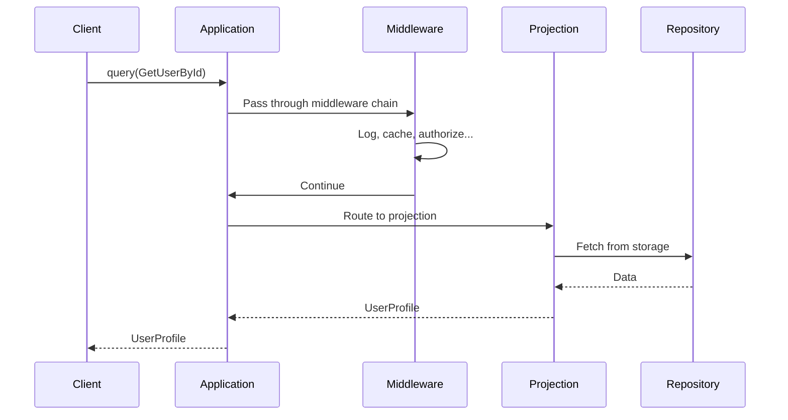

# Queries

A **query** is a message that requests data without changing state. Queries are the read-side counterpart to commands—they represent what a user or system wants to *know*.

## Queries vs Commands

While commands and queries are both messages, they serve opposite purposes:

| Aspect | Commands | Queries |
|--------|----------|---------|
| **Purpose** | Change state | Read state |
| **Side effects** | Yes (events emitted) | No |
| **Handler** | Aggregate | Projection |
| **Return value** | Optional result | Required result |
| **Idempotency** | May need explicit handling | Naturally idempotent |

```python
# Command - requests a change
class DepositMoney(Command[None]):
    amount: int

# Query - requests data
class GetAccountBalance(Query[int]):
    account_id: UUID
```

## Defining Queries

Queries extend `Query[TResponse]` where `TResponse` is the expected return type:

```python
from interlock.domain import Query
from pydantic import BaseModel
from uuid import UUID, uuid4

class UserProfile(BaseModel):
    id: UUID
    name: str
    email: str

# Query that returns a UserProfile
class GetUserById(Query[UserProfile]):
    user_id: UUID

# Query that returns an optional UUID (for lookups)
class GetUserByEmail(Query[UUID | None]):
    email: str

# Query that returns an int
class GetAccountBalance(Query[int]):
    account_id: UUID

# Query that returns a list
class ListRecentOrders(Query[list[Order]]):
    user_id: UUID
    limit: int = 10
```

The type parameter provides:

- **Type safety** — IDE and type checkers verify response types
- **Documentation** — Clear contract for what queries return
- **Autocomplete** — IDE support on query results

## Query Fields

Every query automatically includes these fields:

| Field | Type | Description |
|-------|------|-------------|
| `query_id` | `UUID` | Unique identifier (auto-generated) |
| `correlation_id` | `UUID \| None` | Links related operations |
| `causation_id` | `UUID \| None` | What triggered this query |

```python
query = GetUserById(user_id=some_id)
print(query.query_id)  # Auto-generated UUID
```

Unlike commands, queries don't have an `aggregate_id`—they're routed to 
projections based on which projection has a handler for the query type.

## Naming Conventions

Queries should be named to describe what data they return:

| ✓ Good | ✗ Bad |
|--------|-------|
| `GetUserById` | `UserQuery` |
| `GetAccountBalance` | `BalanceRequest` |
| `ListRecentOrders` | `OrdersQuery` |
| `FindUserByEmail` | `EmailLookup` |
| `CountActiveUsers` | `UserCount` |

Common prefixes:

- `Get...` — Retrieve a single item by ID
- `Find...` — Search/lookup by criteria
- `List...` — Return a collection
- `Count...` — Return an aggregate count
- `Check...` — Return a boolean

## Dispatching Queries

Send queries through the application's `query()` method:

```python
from interlock.application import ApplicationBuilder

app = (
    ApplicationBuilder()
    .register_projection(UserProjection)
    .build()
)

async with app:
    # Get user by ID (returns UserProfile)
    user = await app.query(GetUserById(user_id=user_id))
    print(user.name)
    
    # Find user by email (returns UUID | None)
    found_id = await app.query(GetUserByEmail(email="alice@example.com"))
    if found_id:
        print(f"Found user: {found_id}")
    
    # Count all users (returns int)
    count = await app.query(CountUsers())
    print(f"Total users: {count}")
```

### What Happens During Dispatch



## Query Routing

Queries are routed to projections through a two-step process:

1. **Find the projection type**: Based on which projection has a `@handles_query` handler for this query type
2. **Get the projection instance**: From the projection registry
3. **Execute the handler**: Returns the typed response

```python
class UserProjection(Projection):
    @handles_query
    async def get_user(self, query: GetUserById) -> UserProfile:
        # This handler tells Interlock that GetUserById
        # should be routed to UserProjection
        ...
```

### Multiple Projections

Different queries route to different projections:

```python
class UserProjection(Projection):
    @handles_query
    async def get_user(self, query: GetUserById) -> UserProfile: ...

class OrderProjection(Projection):
    @handles_query
    async def list_orders(self, query: ListRecentOrders) -> list[Order]: ...

# Queries route to the correct projection
user = await app.query(GetUserById(...))      # → UserProjection
orders = await app.query(ListRecentOrders(...))  # → OrderProjection
```

## Correlation and Causation

Like commands, queries support distributed tracing:

```python
# Query triggered by a command handler or saga
balance = await app.query(GetAccountBalance(
    account_id=account_id,
    correlation_id=context.correlation_id,  # Same trace
    causation_id=context.command_id  # What caused this query
))
```

This enables:

- **Tracing**: Follow read operations in distributed traces
- **Debugging**: Understand what triggered expensive queries
- **Auditing**: Track who queried what data

## Validation

Queries support Pydantic validation:

```python
from pydantic import Field

class ListRecentOrders(Query[list[Order]]):
    user_id: UUID
    limit: int = Field(default=10, ge=1, le=100)  # 1-100 range
    offset: int = Field(default=0, ge=0)

# This raises ValidationError
ListRecentOrders(user_id=uuid4(), limit=500)  # limit > 100
```

## Common Patterns

### Lookup Queries

Dereference natural identifiers to aggregate IDs:

```python
class GetAccountIdByEmail(Query[UUID | None]):
    """Find account aggregate ID by email address."""
    email: str

# Usage: find aggregate ID, then dispatch command
account_id = await app.query(GetAccountIdByEmail(email="alice@example.com"))
if account_id:
    await app.dispatch(DepositMoney(aggregate_id=account_id, amount=100))
```

### Existence Checks

```python
class CheckEmailExists(Query[bool]):
    email: str

exists = await app.query(CheckEmailExists(email="alice@example.com"))
if exists:
    raise EmailAlreadyTakenError()
```

### Paginated Queries

```python
class Page(BaseModel, Generic[T]):
    items: list[T]
    total: int
    has_more: bool

class ListUsers(Query[Page[UserSummary]]):
    limit: int = 20
    cursor: str | None = None

page = await app.query(ListUsers(limit=20))
print(f"Showing {len(page.items)} of {page.total} users")
```

## Best Practices

### Keep Queries Focused

Each query should return data for a specific use case:

```python
# Too broad - returns everything
class GetUser(Query[User]):
    user_id: UUID

# Focused - returns what the profile page needs
class GetUserProfile(Query[UserProfile]):
    user_id: UUID

# Focused - returns what the admin dashboard needs  
class GetUserAdminView(Query[UserAdminDetails]):
    user_id: UUID
```

### Include Necessary Parameters

Queries should carry all information needed to fetch the data:

```python
# Missing context
class ListOrders(Query[list[Order]]):
    pass  # Whose orders? How many?

# Complete context
class ListOrders(Query[list[Order]]):
    user_id: UUID
    status: OrderStatus | None = None
    limit: int = 20
```

### Return Rich Types

Return structured types, not dictionaries:

```python
# Avoid - loses type safety
class GetUser(Query[dict]):
    user_id: UUID

# Better - strongly typed
class GetUser(Query[UserProfile]):
    user_id: UUID
```

## Further Reading

- [Projections](projections.md) — Where queries are handled
- [Commands](commands.md) — The write-side counterpart
- [CQRS](cqrs.md) — The pattern queries implement
- [Custom Middleware](../guides/custom-middleware.md) — Intercepting queries

