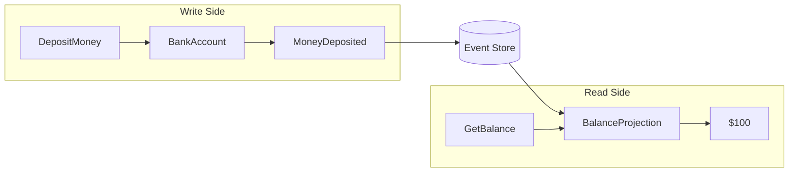

# Quick Start

Build your first event-sourced application in 5 minutes.

!!! tip "Prerequisites"
    Make sure you have [installed Interlock](index.md) before continuing.

## Step 1: Define Your Domain

```python
from pydantic import BaseModel
from ulid import ULID

from interlock.domain import Aggregate, Command, Query
from interlock.routing import handles_command, applies_event

# Define commands (write operations)
class OpenAccount(Command[None]):
    owner_name: str

class DepositMoney(Command[None]):
    amount: int

# Define queries (read operations)
class GetBalance(Query[int]):
    account_id: ULID

# Define event data
class AccountOpened(BaseModel):
    owner_name: str

class MoneyDeposited(BaseModel):
    amount: int

# Define an aggregate
class BankAccount(Aggregate):
    owner_name: str = ""
    balance: int = 0

    @handles_command
    async def open(self, command: OpenAccount) -> None:
        self.emit(AccountOpened(owner_name=command.owner_name))

    @handles_command
    async def deposit(self, command: DepositMoney) -> None:
        if command.amount <= 0:
            raise ValueError("Amount must be positive")
        self.emit(MoneyDeposited(amount=command.amount))

    @applies_event
    def apply_opened(self, event: AccountOpened) -> None:
        self.owner_name = event.owner_name

    @applies_event
    def apply_deposit(self, event: MoneyDeposited) -> None:
        self.balance += event.amount
```

## Step 2: Define a Projection

Projections build read models from events and serve queries:

```python
from interlock.application import Projection
from interlock.routing import handles_event, handles_query

class BalanceProjection(Projection):
    def __init__(self):
        super().__init__()
        self.balances: dict[ULID, int] = {}

    @handles_event
    async def on_deposit(self, event: MoneyDeposited, aggregate_id: ULID) -> None:
        current = self.balances.get(aggregate_id, 0)
        self.balances[aggregate_id] = current + event.amount

    @handles_query
    async def get_balance(self, query: GetBalance) -> int:
        return self.balances.get(query.account_id, 0)
```

## Step 3: Create an Application

```python
from interlock.application import ApplicationBuilder

app = (
    ApplicationBuilder()
    .register_aggregate(BankAccount)
    .register_projection(BalanceProjection)
    .build()
)
```

## Step 4: Send Commands and Queries

```python
async def main():
    async with app:
        # Create a new account
        account_id = ULID()
        await app.dispatch(OpenAccount(
            aggregate_id=account_id,
            owner_name="Alice"
        ))
        
        # Deposit money
        await app.dispatch(DepositMoney(
            aggregate_id=account_id,
            amount=100
        ))
        
        # Query the balance
        balance = await app.query(GetBalance(account_id=account_id))
        print(f"Balance: ${balance}")  # Balance: $100

# Run it
import asyncio
asyncio.run(main())
```

## What Just Happened?

### Write Side (Commands)

1. **Command dispatched**: `DepositMoney` was sent to the application
2. **Aggregate loaded**: The `BankAccount` aggregate was created (or loaded from events)
3. **Handler executed**: `@handles_command` method validated and emitted an event
4. **Event applied**: `@applies_event` method updated the aggregate's state
5. **Event persisted**: The event was stored (in-memory by default)

### Read Side (Queries)

1. **Query dispatched**: `GetBalance` was sent to the application
2. **Projection found**: The framework routed the query to `BalanceProjection`
3. **Handler executed**: `@handles_query` method returned the balance
4. **Result returned**: The typed response was returned to the caller



## Next Steps

- [:octicons-arrow-right-24: Follow the full tutorial](../tutorial/index.md)
- [:octicons-arrow-right-24: Learn about concepts](../concepts/index.md)
- [:octicons-arrow-right-24: Explore the API reference](../reference/index.md)
