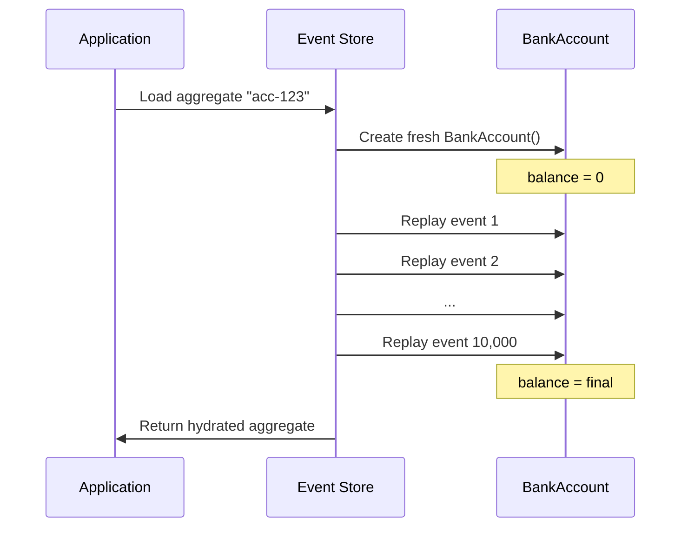
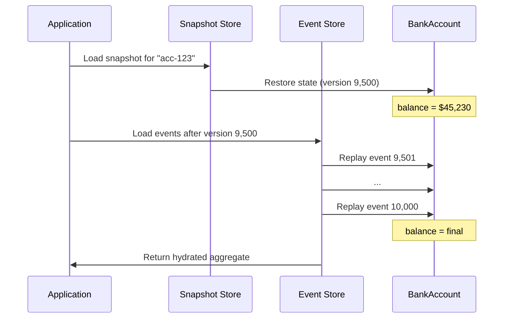
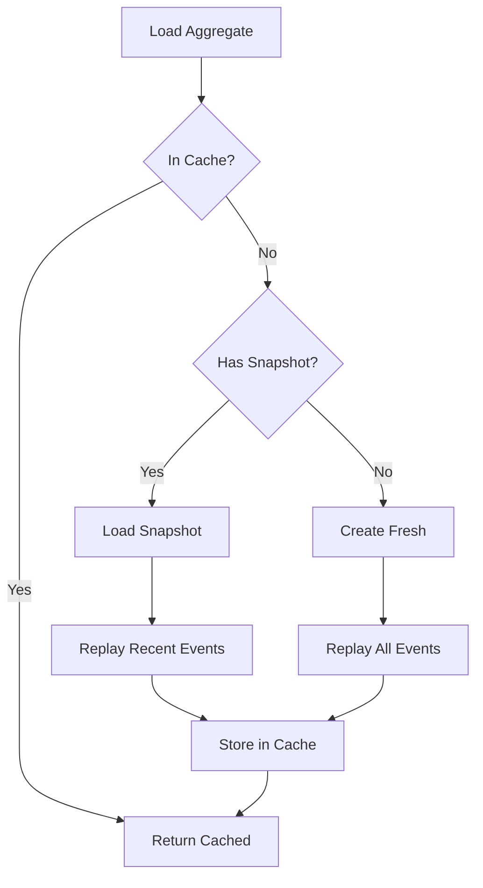

# Aggregate Optimization

As your aggregates accumulate events, loading them by replaying every event becomes expensive. Interlock provides **snapshots** and **caching** to optimize aggregate loading performance.

## The Problem

Every time an aggregate is loaded, Interlock replays all its events to rebuild the current state:



For aggregates with thousands of events, this replay can be slow. Two optimization strategies help:

| Strategy | What it does | Best for |
|----------|--------------|----------|
| **Snapshots** | Periodically save aggregate state | Long-lived aggregates with many events |
| **Caching** | Keep recently-used aggregates in memory | Frequently accessed aggregates |

## Snapshots

A snapshot saves the aggregate's full state at a point in time. When loading, Interlock loads the snapshot and only replays events that occurred *after* it:



Instead of replaying 10,000 events, we only replay 500.

### Snapshot Strategies

A **snapshot strategy** decides *when* to create snapshots. Configure it per-aggregate:

```python
from interlock.application import ApplicationBuilder
from interlock.application.aggregates import SnapshotAfterN, SnapshotAfterTime
from datetime import timedelta

app = (
    ApplicationBuilder()
    .register_aggregate(
        BankAccount,
        snapshot_strategy=SnapshotAfterN(100),  # Snapshot every 100 events
    )
    .build()
)
```

#### Available Strategies

| Strategy | Description | When to use |
|----------|-------------|-------------|
| `NeverSnapshot` | Never create snapshots (default) | Small aggregates, few events |
| `SnapshotAfterN(n)` | Snapshot every N events | Most common choice |
| `SnapshotAfterTime(delta)` | Snapshot after time elapsed since last snapshot | Time-based policies |

**`SnapshotAfterN(n)`** - Create a snapshot when `aggregate.version % n == 0`:

```python
from interlock.application.aggregates import SnapshotAfterN

# Snapshot at versions 100, 200, 300, ...
snapshot_strategy=SnapshotAfterN(100)
```

**`SnapshotAfterTime(timedelta)`** - Create a snapshot if the last snapshot is older than the threshold:

```python
from interlock.application.aggregates import SnapshotAfterTime
from datetime import timedelta

# Snapshot if last snapshot was > 1 hour ago
snapshot_strategy=SnapshotAfterTime(timedelta(hours=1))
```

### Snapshot Storage Backends

A **snapshot backend** handles persisting and loading snapshots. Configure it per-aggregate:

```python
from interlock.application.aggregates import InMemoryAggregateSnapshotStorageBackend

app = (
    ApplicationBuilder()
    .register_aggregate(
        BankAccount,
        snapshot_strategy=SnapshotAfterN(100),
        snapshot_backend=InMemoryAggregateSnapshotStorageBackend,
    )
    .build()
)
```

#### Available Backends

| Backend | Description | When to use |
|---------|-------------|-------------|
| `NullAggregateSnapshotStorageBackend` | No-op, doesn't store (default) | Snapshots disabled |
| `InMemoryAggregateSnapshotStorageBackend` | Stores in memory | Testing, development |

For production, you'll typically implement a custom backend backed by your database. See the [Database Integrations](database-integrations.md) guide for planned implementations.

### Custom Snapshot Backend

Implement `AggregateSnapshotStorageBackend` for your storage:

```python
from interlock.application.aggregates import AggregateSnapshotStorageBackend
from interlock.domain import Aggregate
from uuid import UUID, uuid4
from typing import TypeVar

T = TypeVar("T", bound=Aggregate)

class PostgresSnapshotBackend(AggregateSnapshotStorageBackend):
    def __init__(self, connection_pool, aggregate_type: type[Aggregate]):
        self.pool = connection_pool
        self.aggregate_type = aggregate_type
    
    async def save_snapshot(self, aggregate: Aggregate) -> None:
        async with self.pool.acquire() as conn:
            await conn.execute(
                """
                INSERT INTO snapshots (aggregate_id, aggregate_type, version, data)
                VALUES ($1, $2, $3, $4)
                ON CONFLICT (aggregate_id) DO UPDATE
                SET version = $3, data = $4
                """,
                str(aggregate.id),
                type(aggregate).__name__,
                aggregate.version,
                aggregate.model_dump_json()
            )
    
    async def load_snapshot(
        self, 
        aggregate_id: UUID,
        intended_version: int | None = None
    ) -> Aggregate | None:
        async with self.pool.acquire() as conn:
            row = await conn.fetchrow(
                "SELECT data, version FROM snapshots WHERE aggregate_id = $1",
                str(aggregate_id)
            )
            if row and (intended_version is None or row['version'] <= intended_version):
                return self.aggregate_type.model_validate_json(row['data'])
            return None
```

## Caching

Caching keeps recently-loaded aggregates in memory to avoid reloading them entirely.

### Cache Strategies

A **cache strategy** decides *which* aggregates to cache:

```python
from interlock.application.aggregates import AlwaysCache

app = (
    ApplicationBuilder()
    .register_aggregate(
        BankAccount,
        cache_strategy=AlwaysCache,
    )
    .build()
)
```

#### Available Strategies

| Strategy | Description | When to use |
|----------|-------------|-------------|
| `NeverCache` | Never cache aggregates (default) | Memory-constrained, low reuse |
| `AlwaysCache` | Cache all loaded aggregates | High reuse, sufficient memory |

### Cache Backends

A **cache backend** handles storing and retrieving cached aggregates:

```python
from interlock.application.aggregates import AlwaysCache

app = (
    ApplicationBuilder()
    .register_aggregate(
        BankAccount,
        cache_strategy=AlwaysCache,
        cache_backend=RedisAggregateCacheBackend,  # Custom implementation
    )
    .build()
)
```

#### Available Backends

| Backend | Description | When to use |
|---------|-------------|-------------|
| `NullAggregateCacheBackend` | No-op, doesn't cache (default) | Caching disabled |

For production caching (Redis, Memcached), implement a custom backend.

### Custom Cache Backend

Implement `AggregateCacheBackend` for your cache:

```python
from interlock.application.aggregates import AggregateCacheBackend
from interlock.domain import Aggregate
from uuid import UUID, uuid4

class RedisAggregateCacheBackend(AggregateCacheBackend):
    def __init__(self, redis_client):
        self.redis = redis_client
        self.ttl = 3600  # 1 hour
    
    async def get_aggregate(self, aggregate_id: UUID) -> Aggregate | None:
        data = await self.redis.get(f"agg:{aggregate_id}")
        if data:
            return Aggregate.model_validate_json(data)
        return None
    
    async def set_aggregate(self, aggregate: Aggregate) -> None:
        await self.redis.setex(
            f"agg:{aggregate.id}",
            self.ttl,
            aggregate.model_dump_json()
        )
    
    async def remove_aggregate(self, aggregate_id: UUID) -> None:
        await self.redis.delete(f"agg:{aggregate_id}")
```

## Combining Strategies

For optimal performance, combine snapshots and caching:

```python
from interlock.application import ApplicationBuilder
from interlock.application.aggregates import (
    SnapshotAfterN,
    AlwaysCache,
    InMemoryAggregateSnapshotStorageBackend,
)

app = (
    ApplicationBuilder()
    .register_aggregate(
        BankAccount,
        snapshot_strategy=SnapshotAfterN(100),
        snapshot_backend=InMemoryAggregateSnapshotStorageBackend,
        cache_strategy=AlwaysCache,
        cache_backend=RedisAggregateCacheBackend,
    )
    .build()
)
```

The loading flow becomes:



## Best Practices

### When to Use Snapshots

| Scenario | Recommendation |
|----------|----------------|
| < 100 events per aggregate | Probably not needed |
| 100-1000 events | Consider `SnapshotAfterN(100)` |
| > 1000 events | Definitely use snapshots |
| Aggregates with expensive event application | Lower snapshot threshold |

### When to Use Caching

| Scenario | Recommendation |
|----------|----------------|
| Single-use aggregates | Don't cache (`NeverCache`) |
| Frequently accessed aggregates | Use `AlwaysCache` + Redis |
| Memory-constrained environments | Be selective or skip caching |
| Multi-instance deployments | Use distributed cache (Redis) |

### Snapshot vs Cache

| Aspect | Snapshot | Cache |
|--------|----------|-------|
| **Persistence** | Durable (survives restart) | Ephemeral (lost on restart) |
| **Scope** | All events before snapshot | Current loaded state |
| **Storage** | Database | Memory or distributed cache |
| **Purpose** | Reduce replay time | Avoid any loading |

## Further Reading

- [Aggregates Concept](../concepts/aggregates.md) — Understanding aggregates
- [Event Sourcing](../concepts/event-sourcing.md) — Why events are replayed
- [Database Integrations](database-integrations.md) — Production storage backends

