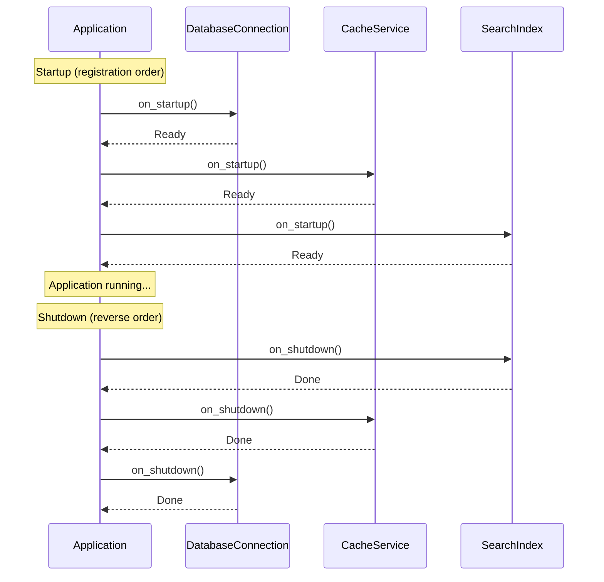

# Application Lifecycle

Interlock provides hooks for managing the lifecycle of your application's dependencies—starting database connections, initializing external services, and cleaning up resources gracefully.

## The HasLifecycle Protocol

Any dependency can participate in the application lifecycle by implementing the `HasLifecycle` protocol:

```python
from interlock.application import HasLifecycle

class DatabaseConnection(HasLifecycle):
    def __init__(self, connection_string: str):
        self.connection_string = connection_string
        self.connection = None

    async def on_startup(self) -> None:
        """Called when the application starts."""
        self.connection = await connect(self.connection_string)
        print("Database connected")

    async def on_shutdown(self) -> None:
        """Called when the application shuts down."""
        await self.connection.close()
        print("Database disconnected")
```

The protocol defines two methods:

| Method | When Called | Purpose |
|--------|-------------|---------|
| `on_startup()` | Application startup | Initialize resources, open connections |
| `on_shutdown()` | Application shutdown | Clean up resources, close connections |

## Using the Context Manager

The simplest way to manage lifecycle is with the async context manager:

```python
from interlock.application import ApplicationBuilder

app = (
    ApplicationBuilder()
    .register_dependency(DatabaseConnection, lambda: DatabaseConnection("postgres://..."))
    .register_aggregate(BankAccount)
    .build()
)

async def main():
    async with app:
        # on_startup() called for all HasLifecycle dependencies
        await app.dispatch(DepositMoney(aggregate_id=account_id, amount=100))
        # ... your application logic ...
    # on_shutdown() called for all HasLifecycle dependencies
```

This ensures:

- All `on_startup()` methods complete before your code runs
- All `on_shutdown()` methods run even if exceptions occur
- Resources are properly cleaned up

## Manual Lifecycle Control

For more control, call startup and shutdown explicitly:

```python
app = ApplicationBuilder().build()

# Start the application
await app.startup()

try:
    # Run your application
    await run_server(app)
finally:
    # Always shutdown, even on error
    await app.shutdown()
```

## Startup and Shutdown Order

Dependencies start in **registration order** and shut down in **reverse order**:

```python
app = (
    ApplicationBuilder()
    .register_dependency(DatabaseConnection)   # Starts 1st, shuts down 3rd
    .register_dependency(CacheService)         # Starts 2nd, shuts down 2nd
    .register_dependency(SearchIndex)          # Starts 3rd, shuts down 1st
    .build()
)
```



This ordering is important when dependencies have relationships. For example:

- A cache that depends on a database should start after the database
- The cache should shut down before the database closes

## Common Use Cases

### Database Connections

```python
class PostgresConnection(HasLifecycle):
    def __init__(self, config: DatabaseConfig):
        self.config = config
        self.pool = None

    async def on_startup(self) -> None:
        self.pool = await asyncpg.create_pool(
            host=self.config.host,
            port=self.config.port,
            database=self.config.database,
            user=self.config.user,
            password=self.config.password,
        )

    async def on_shutdown(self) -> None:
        await self.pool.close()

    async def execute(self, query: str, *args):
        async with self.pool.acquire() as conn:
            return await conn.execute(query, *args)
```

### Message Broker Connections

```python
class KafkaProducer(HasLifecycle):
    def __init__(self, config: KafkaConfig):
        self.config = config
        self.producer = None

    async def on_startup(self) -> None:
        self.producer = AIOKafkaProducer(
            bootstrap_servers=self.config.brokers
        )
        await self.producer.start()

    async def on_shutdown(self) -> None:
        await self.producer.stop()

    async def send(self, topic: str, message: bytes) -> None:
        await self.producer.send_and_wait(topic, message)
```

### External Service Clients

```python
class PaymentGateway(HasLifecycle):
    def __init__(self, api_key: str):
        self.api_key = api_key
        self.session = None

    async def on_startup(self) -> None:
        self.session = aiohttp.ClientSession(
            headers={"Authorization": f"Bearer {self.api_key}"}
        )

    async def on_shutdown(self) -> None:
        await self.session.close()

    async def charge(self, amount: int, customer_id: str) -> str:
        async with self.session.post("/charge", json={...}) as resp:
            return (await resp.json())["transaction_id"]
```

### Health Check Services

```python
class HealthCheckService(HasLifecycle):
    def __init__(self, dependencies: list[HasLifecycle]):
        self.dependencies = dependencies
        self.healthy = False

    async def on_startup(self) -> None:
        # All dependencies are started by this point
        self.healthy = True

    async def on_shutdown(self) -> None:
        self.healthy = False

    def is_healthy(self) -> bool:
        return self.healthy
```

## Integration with Event Stores and Transports

Interlock's built-in backends (event stores, transports, etc.) can also implement `HasLifecycle`. When using database integrations, the connection lifecycle is managed automatically:

```python
from interlock.integrations.mongodb import MongoEventStore

app = (
    ApplicationBuilder()
    .register_dependency(EventStore, MongoEventStore)
    .build()
)

async with app:
    # MongoDB connection opened automatically
    await app.dispatch(...)
# MongoDB connection closed automatically
```

## Error Handling

If `on_startup()` fails for any dependency, the application raises the exception immediately. Dependencies that successfully started are **not** automatically shut down—you should handle this in your error handling:

```python
try:
    async with app:
        await run_application()
except StartupError as e:
    logger.error(f"Startup failed: {e}")
    # Consider manual cleanup if needed
```

If `on_shutdown()` fails, the exception is logged but shutdown continues for remaining dependencies. This ensures all resources attempt cleanup even if one fails.

## Best Practices

### 1. Keep Lifecycle Methods Fast

Startup and shutdown should be quick. Defer heavy initialization if possible:

```python
async def on_startup(self) -> None:
    # Good: Just open connection
    self.connection = await connect()

    # Avoid: Heavy data loading
    # self.cache = await load_entire_database()
```

### 2. Handle Partial Startup

Design components to handle cases where not all dependencies started:

```python
async def on_shutdown(self) -> None:
    if self.connection is not None:
        await self.connection.close()
```

### 3. Log Lifecycle Events

Add logging to track startup/shutdown progress:

```python
async def on_startup(self) -> None:
    logger.info("Starting database connection...")
    self.connection = await connect()
    logger.info("Database connection established")
```

### 4. Use Timeouts

Prevent hanging on startup/shutdown:

```python
async def on_startup(self) -> None:
    try:
        self.connection = await asyncio.wait_for(
            connect(), 
            timeout=30.0
        )
    except asyncio.TimeoutError:
        raise StartupError("Database connection timed out")
```

## Testing with Lifecycle

In tests, you can mock or stub lifecycle dependencies:

```python
class StubDatabase(HasLifecycle):
    async def on_startup(self) -> None:
        pass  # No-op for tests

    async def on_shutdown(self) -> None:
        pass

@pytest.fixture
def app():
    return (
        ApplicationBuilder()
        .register_dependency(DatabaseConnection, StubDatabase)
        .build()
    )

async def test_with_lifecycle(app):
    async with app:
        # Test your application
        pass
```

## Further Reading

- [Database Integrations](database-integrations.md) — Backend implementations with lifecycle support
- [Tutorial: Structuring Your Application](../tutorial/07-structuring-the-application.md) — Application setup patterns

