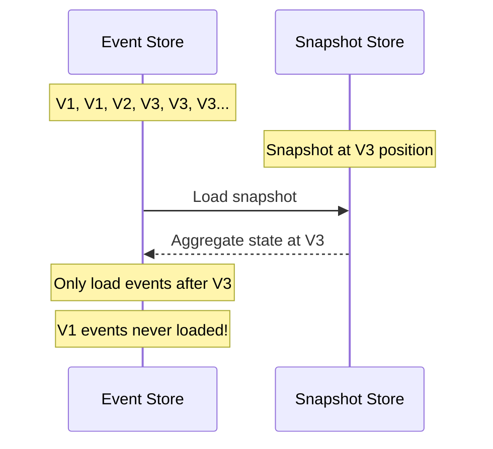

# Event Upcasting

Learn how to evolve your event schemas while maintaining compatibility with historical events.

## Goal

Modify event schemas without breaking existing stored events or requiring data migrations.

## Prerequisites

- Understanding of [Events](../concepts/events.md)
- Familiarity with event versioning concepts

## The Problem

Events are immutable—once stored, they never change. But your domain model evolves. 
When you need to add, remove, or restructure fields in an event, old events in the 
store won't match your new schema.

Consider a `MoneyDeposited` event that originally only tracked the amount:

```python
from pydantic import BaseModel

class MoneyDeposited(BaseModel):
    amount: int
```

Later, you need to track the deposit source for compliance:

```python
class MoneyDeposited(BaseModel):
    amount: int
    source: str  # New required field!
```

Now you have a problem: historical events don't have a `source` field. Loading them 
will fail with a validation error.

## Do You Actually Need Upcasting?

Before reaching for upcasters, ask yourself: **can Pydantic handle this?**

Since Interlock uses Pydantic models for events, many simple schema changes are 
handled automatically with default values:

```python
class MoneyDeposited(BaseModel):
    amount: int
    source: str = "unknown"  # Default handles missing field!
```

Old events without `source` will load successfully—Pydantic fills in the default.

### When Pydantic Defaults Are Enough

| Change | Solution |
|--------|----------|
| Add optional field | `new_field: str \| None = None` |
| Add field with sensible default | `status: str = "pending"` |
| Make field optional | `field: str` → `field: str \| None = None` |

### When You Need Upcasting

| Change | Why Upcasting |
|--------|---------------|
| Rename a field | `owner_name` → `holder_name` |
| Split a field | `full_name` → `first_name` + `last_name` |
| Change field type | `price: float` → `price_cents: int` |
| Compute derived value | Need to look up data from a service |
| Complex conditional logic | Different defaults based on other fields |

!!! tip "Start Simple"
    Default to Pydantic defaults. Only introduce upcasters when the transformation 
    requires logic that can't be expressed as a simple default value.

## Solution: Event Upcasting

**Upcasting** transforms old event versions into new versions when loading from the 
event store. Instead of migrating your data, you migrate your events on-the-fly.

The key insight is that you keep **both** event versions in your codebase and define 
a transformation between them:

```python
from pydantic import BaseModel

# Keep the old version (rename it to indicate version)
class MoneyDepositedV1(BaseModel):
    amount: int

# Define the new version
class MoneyDepositedV2(BaseModel):
    amount: int
    source: str
```

## Creating an Upcaster

Upcasters inherit from `EventUpcaster[SourceType, TargetType]` and implement 
the `upcast_payload` method:

```python
from interlock.application.events.upcasting import EventUpcaster

class MoneyDepositedV1ToV2(EventUpcaster[MoneyDepositedV1, MoneyDepositedV2]):
    """Transform MoneyDeposited from V1 to V2."""
    
    async def upcast_payload(self, data: MoneyDepositedV1) -> MoneyDepositedV2:
        return MoneyDepositedV2(
            amount=data.amount,
            source="unknown"  # Default for historical events
        )
```

The framework automatically:

- Extracts the source and target types from the generic parameters
- Preserves event metadata (id, aggregate_id, timestamp, sequence_number)
- Chains multiple upcasters together (V1→V2→V3)

## Registering Upcasters

Register upcasters with the `ApplicationBuilder`:

```python
from interlock.application import ApplicationBuilder

app = (
    ApplicationBuilder()
    .register_aggregate(BankAccount)
    .register_upcaster(MoneyDepositedV1ToV2)
    .build()
)
```

!!! tip "Register the Type, Not an Instance"
    Pass the upcaster class, not an instance. The framework instantiates it 
    and injects any dependencies via the DI container.

## Chaining Upcasters

Upcasters automatically chain. If you have V1→V2 and V2→V3 upcasters, a V1 event 
will be transformed through both to reach V3:

```python
class MoneyDepositedV1(BaseModel):
    amount: int

class MoneyDepositedV2(BaseModel):
    amount: int
    source: str

class MoneyDepositedV3(BaseModel):
    amount: int
    source: str
    currency: str

class MoneyDepositedV1ToV2(EventUpcaster[MoneyDepositedV1, MoneyDepositedV2]):
    async def upcast_payload(self, data: MoneyDepositedV1) -> MoneyDepositedV2:
        return MoneyDepositedV2(amount=data.amount, source="unknown")

class MoneyDepositedV2ToV3(EventUpcaster[MoneyDepositedV2, MoneyDepositedV3]):
    async def upcast_payload(self, data: MoneyDepositedV2) -> MoneyDepositedV3:
        return MoneyDepositedV3(
            amount=data.amount, 
            source=data.source, 
            currency="USD"
        )

# Register both - order doesn't matter
app = (
    ApplicationBuilder()
    .register_aggregate(BankAccount)
    .register_upcaster(MoneyDepositedV1ToV2)
    .register_upcaster(MoneyDepositedV2ToV3)
    .build()
)
```

When a V1 event is loaded, it flows through: **V1 → V2 → V3**.

!!! warning "Always Chain, Never Skip"
    Create upcasters for each version step (V1→V2, V2→V3), not direct jumps 
    (V1→V3). This keeps each transformation simple and testable.

## Async Upcasters with Dependencies

Upcasters can be async and inject dependencies—useful when transformations 
need external data or services.

### Example: Enriching Events with Account Data

Suppose your V1 events only stored an account number, but V2 needs the account 
holder's name. You can inject a service to look up this information:

```python
from abc import ABC, abstractmethod

class AccountLookupService(ABC):
    """Service to look up account information."""
    
    @abstractmethod
    async def get_account_holder(self, account_number: str) -> str:
        """Look up the account holder's name."""
        ...

class DatabaseAccountLookup(AccountLookupService):
    """Production implementation that queries the database."""
    
    def __init__(self, db_connection: DatabaseConnection):
        self.db = db_connection
    
    async def get_account_holder(self, account_number: str) -> str:
        result = await self.db.query(
            "SELECT holder_name FROM accounts WHERE number = ?",
            account_number
        )
        return result["holder_name"] if result else "Unknown"
```

Now define an upcaster that uses this service:

```python
class AccountOpenedV1(BaseModel):
    account_number: str

class AccountOpenedV2(BaseModel):
    account_number: str
    holder_name: str

class AccountOpenedV1ToV2(EventUpcaster[AccountOpenedV1, AccountOpenedV2]):
    """Enrich V1 events with account holder name from database."""
    
    def __init__(self, lookup_service: AccountLookupService):  # (1)!
        self.lookup_service = lookup_service
    
    async def upcast_payload(self, data: AccountOpenedV1) -> AccountOpenedV2:
        # Async call to look up the holder name
        holder_name = await self.lookup_service.get_account_holder(
            data.account_number
        )
        return AccountOpenedV2(
            account_number=data.account_number,
            holder_name=holder_name
        )
```

1. Dependencies are injected by the DI container when the upcaster is instantiated

Register the service and upcaster:

```python
app = (
    ApplicationBuilder()
    .register_aggregate(BankAccount)
    .register_dependency(AccountLookupService, DatabaseAccountLookup)
    .register_upcaster(AccountOpenedV1ToV2)
    .build()
)
```

!!! note "Performance Consideration"
    Async upcasters with I/O can add latency to event loading. Consider caching 
    lookup results or using batch loading strategies for high-volume scenarios.

## Conditional Upcasting

Sometimes you only want to upcast certain events. Override `can_upcast` to 
add conditions:

```python
class LegacyDepositUpcaster(EventUpcaster[MoneyDepositedV1, MoneyDepositedV2]):
    """Only upcast events from before the schema change."""
    
    async def can_upcast(self, event: Event[MoneyDepositedV1]) -> bool:
        # Only upcast events from before 2024
        cutoff = datetime(2024, 1, 1, tzinfo=timezone.utc)
        return event.timestamp < cutoff
    
    async def upcast_payload(self, data: MoneyDepositedV1) -> MoneyDepositedV2:
        return MoneyDepositedV2(amount=data.amount, source="legacy")
```

## Upcasting Strategies

Interlock provides two built-in strategies that control *when* upcasting occurs:

### Lazy Strategy (Recommended)

```python
from interlock.application.events.upcasting import LazyUpcastingStrategy
```

**Upcasts on read only.** Old events remain in storage with their original schema 
and are transformed on-the-fly when loaded.

| Advantages | Disadvantages |
|------------|---------------|
| No need to rewrite event store | Slight performance cost on reads |
| Supports multiple concurrent versions | Old event types must remain in codebase |
| Can evolve upcasting logic over time | — |

This is the **default and recommended** strategy for most applications.

### Eager Strategy

```python
from interlock.application.events.upcasting import EagerUpcastingStrategy
```

**Upcasts on both read and write.** New events are written in the latest schema, 
and old events are transformed when loaded.

| Advantages | Disadvantages |
|------------|---------------|
| Event store gradually migrates to new schema | More complex to reason about |
| Eventually can remove old event types | May conflict with event immutability principles |
| — | Requires careful handling |

Use this when you have a clear migration timeline and want to eventually remove 
old event types from your codebase.

### Custom Strategies

You can create custom strategies by implementing the `UpcastingStrategy` interface:

```python
from interlock.application.events.upcasting import UpcastingStrategy

class CustomUpcastingStrategy(UpcastingStrategy):
    """Custom strategy based on environment."""
    
    def __init__(self, is_migration_mode: bool):
        self.is_migration_mode = is_migration_mode
    
    def should_upcast_on_read(self) -> bool:
        return True  # Always upcast on read
    
    def should_upcast_on_write(self) -> bool:
        return self.is_migration_mode  # Only during migration
```

Register a custom strategy per-upcaster:

```python
app = (
    ApplicationBuilder()
    .register_upcaster(MoneyDepositedV1ToV2, CustomUpcastingStrategy)
    .build()
)
```

## The Trade-off: Keeping Old Event Types

Upcasting requires keeping old event type definitions in your codebase. This is 
the fundamental trade-off:

```
┌─────────────────────────────────────────────────────────────────┐
│                         Your Codebase                           │
├─────────────────────────────────────────────────────────────────┤
│  MoneyDepositedV1  ──────► MoneyDepositedV1ToV2 ──────►        │
│  MoneyDepositedV2  ──────► MoneyDepositedV2ToV3 ──────►        │
│  MoneyDepositedV3  (current version, used by aggregates)       │
└─────────────────────────────────────────────────────────────────┘
```

You can't delete `MoneyDepositedV1` until **no V1 events exist in your event store**.

### When Is It Safe to Delete Old Event Types?

You can remove an old event type when:

1. **All events have been migrated** — No V1 events remain in storage
2. **No replay is needed** — You won't need to rebuild state from scratch
3. **Snapshots are current** — All aggregates have recent snapshots past the old events

### Migration Strategies

#### Option 1: Natural Migration (Lazy Strategy)

With lazy upcasting, old events are never rewritten. They stay in storage 
indefinitely, and you keep the old types forever. This is simple but means 
carrying legacy code.

#### Option 2: Gradual Migration (Eager Strategy)

With eager upcasting, events are rewritten when loaded. Over time, as aggregates 
are accessed, the store migrates naturally. However, rarely-accessed aggregates 
may retain old events indefinitely.

#### Option 3: Batch Migration Job

Run a one-time migration job to upcast all events:

```python
async def migrate_all_events(app: Application):
    """Migrate all events to latest schema."""
    
    # Get all aggregate IDs (implementation depends on your store)
    aggregate_ids = await get_all_aggregate_ids()
    
    for aggregate_id in aggregate_ids:
        # Loading events triggers upcasting
        events = await app.event_bus.load_events(aggregate_id, min_version=0)
        
        # If using eager strategy, events are already rewritten
        # If using lazy strategy, you need to explicitly rewrite:
        if should_persist_upcasted:
            await app.event_store.rewrite_events(aggregate_id, events)
    
    print(f"Migrated {len(aggregate_ids)} aggregates")
```

!!! warning "Batch Migration Considerations"
    - Run during low-traffic periods
    - Consider pagination for large event stores
    - Verify the migration with checksums or counts
    - Keep backups before rewriting events

#### Option 4: Snapshot-Based Retirement

If you use snapshots, old events become irrelevant once an aggregate has a 
snapshot past all V1 events:



Once all aggregates have snapshots past V1 events, you can:

1. Stop registering the V1→V2 upcaster
2. Archive or delete the V1 event type code

### Best Practices for Event Type Lifecycle

1. **Version your event types explicitly**: Use `V1`, `V2` suffixes or a version field
2. **Document the migration timeline**: Track when each version was introduced
3. **Monitor event versions in production**: Log which versions are still being loaded
4. **Clean up systematically**: Remove old types only after confirming they're unused

```python
# Example: Logging to track event version usage
class MonitoredUpcaster(EventUpcaster[MoneyDepositedV1, MoneyDepositedV2]):
    def __init__(self, metrics: MetricsService):
        self.metrics = metrics
    
    async def upcast_payload(self, data: MoneyDepositedV1) -> MoneyDepositedV2:
        self.metrics.increment("events.upcasted.MoneyDepositedV1")
        return MoneyDepositedV2(amount=data.amount, source="unknown")
```

When the counter stops increasing for an extended period, it's safe to consider 
removing that event type.

## Testing Upcasters

Test upcasters like any other unit:

```python
import pytest
from uuid import UUID, uuid4
from interlock.domain import Event

@pytest.mark.asyncio
async def test_upcaster_transforms_data():
    upcaster = MoneyDepositedV1ToV2()
    
    v1_data = MoneyDepositedV1(amount=100)
    v2_data = await upcaster.upcast_payload(v1_data)
    
    assert v2_data.amount == 100
    assert v2_data.source == "unknown"

@pytest.mark.asyncio
async def test_upcaster_preserves_event_metadata():
    upcaster = MoneyDepositedV1ToV2()
    
    original = Event(
        aggregate_id=uuid4(),
        data=MoneyDepositedV1(amount=100),
        sequence_number=5,
    )
    
    upcasted = await upcaster.upcast_event(original)
    
    # Metadata preserved
    assert upcasted.aggregate_id == original.aggregate_id
    assert upcasted.sequence_number == original.sequence_number
    assert upcasted.timestamp == original.timestamp
    
    # Data transformed
    assert isinstance(upcasted.data, MoneyDepositedV2)
```

For upcasters with dependencies, inject mocks or stubs:

```python
@pytest.mark.asyncio
async def test_upcaster_with_service_dependency():
    # Create a stub service
    class StubAccountLookup(AccountLookupService):
        async def get_account_holder(self, account_number: str) -> str:
            return "Jane Doe"
    
    upcaster = AccountOpenedV1ToV2(StubAccountLookup())
    
    v1_data = AccountOpenedV1(account_number="123456")
    v2_data = await upcaster.upcast_payload(v1_data)
    
    assert v2_data.holder_name == "Jane Doe"
```

## Summary

| Concept | Description |
|---------|-------------|
| **EventUpcaster[T, U]** | Base class for transforming event type T to type U |
| **upcast_payload()** | Async method implementing the transformation logic |
| **can_upcast()** | Optional method for conditional upcasting |
| **LazyUpcastingStrategy** | Upcast on read only (recommended) |
| **EagerUpcastingStrategy** | Upcast on read and write |
| **Chaining** | V1→V2→V3 happens automatically |

## Next Steps

- [Events Concept](../concepts/events.md) — Deep dive into event design
- [Tutorial: Events & Sourcing](../tutorial/03-events-and-sourcing.md) — Hands-on event sourcing
- [API Reference](../reference/index.md) — Complete API documentation
