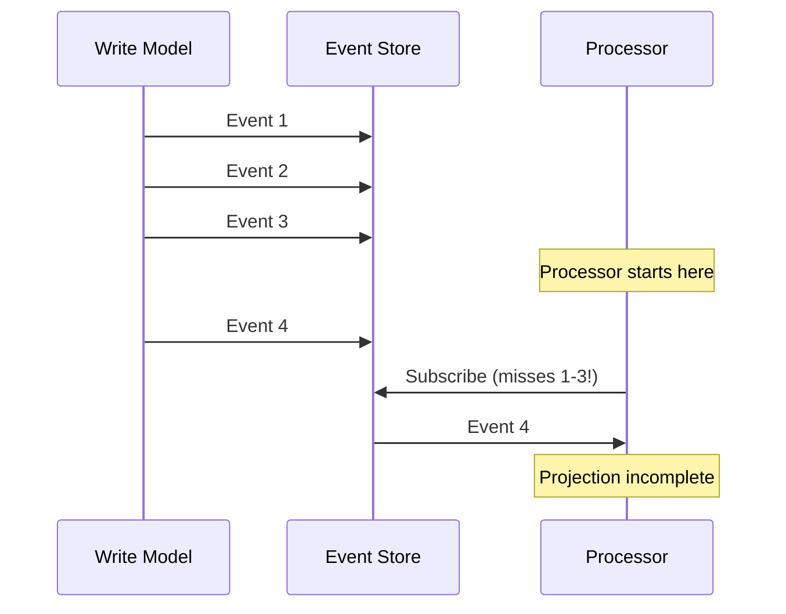
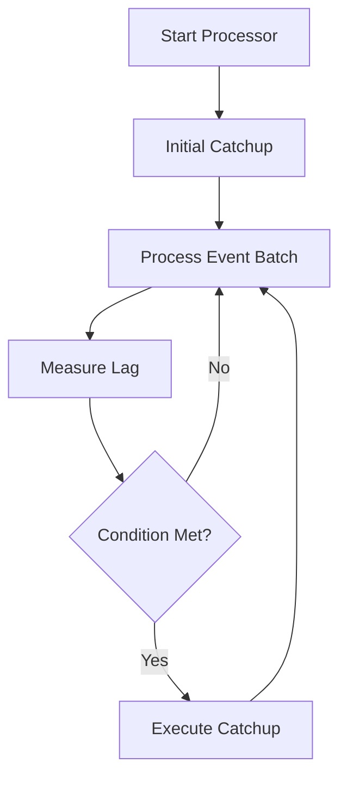

# Event Processor Catchup

Event processors can fall behind the event stream or start after events have already been published. **Catchup** mechanisms help processors synchronize with the event store.

## The Problem

Event processors can become out of sync with the write model when:

- They're **created after events** have already been published
- They experience **downtime** while events continue flowing
- They **process slower** than events are produced



The processor misses events 1-3, resulting in an incomplete projection.

## Catchup Conditions

A **catchup condition** determines *when* to trigger catchup based on processor lag metrics.

### Lag Metrics

Interlock measures two dimensions of processor lag:

| Metric | What it measures | Indicates |
|--------|------------------|-----------|
| `unprocessed_events` | Queue depth (events waiting) | Volume problem (backlog) |
| `average_event_age` | Mean age of recent events | Latency problem (slowness) |

These metrics are captured in a `Lag` dataclass:

```python
from datetime import timedelta
from interlock.application.events.processing import Lag

lag = Lag(
    unprocessed_events=5000,
    average_event_age=timedelta(minutes=3)
)

# Helper methods for evaluation
lag.unprocessed_events_is_greater_than(1000)  # True
lag.average_age_is_older_than(timedelta(minutes=5))  # False
```

### Available Conditions

#### `Never` (default)

Never trigger catchup—processor only handles new events:

```python
from interlock.application.events.processing import Never

# Disable catchup entirely
condition = Never()
```

Use when:

- Processor only needs new events (e.g., notifications)
- Catchup is managed externally
- Testing scenarios

#### `AfterNEvents(n)`

Trigger when unprocessed event count exceeds a threshold:

```python
from interlock.application.events.processing import AfterNEvents

# Catchup if backlog exceeds 10,000 events
condition = AfterNEvents(10_000)
```

Use when:

- Preventing unbounded queue growth
- Volume-based catchup policies

#### `AfterNAge(timedelta)`

Trigger when average event age exceeds a threshold:

```python
from interlock.application.events.processing import AfterNAge
from datetime import timedelta

# Catchup if events are > 5 minutes old on average
condition = AfterNAge(timedelta(minutes=5))
```

Use when:

- Ensuring data freshness
- Time-based SLA requirements

#### `AnyOf(*conditions)`

Trigger if **any** condition is met (OR logic):

```python
from interlock.application.events.processing import AnyOf, AfterNEvents, AfterNAge
from datetime import timedelta

# Catchup if EITHER queue > 5000 OR events > 10min old
condition = AnyOf(
    AfterNEvents(5000),
    AfterNAge(timedelta(minutes=10))
)
```

#### `AllOf(*conditions)`

Trigger only if **all** conditions are met (AND logic):

```python
from interlock.application.events.processing import AllOf, AfterNEvents, AfterNAge
from datetime import timedelta

# Catchup only if BOTH queue > 1000 AND events > 5min old
condition = AllOf(
    AfterNEvents(1000),
    AfterNAge(timedelta(minutes=5))
)
```

### Configuring Conditions

Register conditions when adding processors:

```python
from interlock.application import ApplicationBuilder
from interlock.application.events.processing import AfterNEvents

app = (
    ApplicationBuilder()
    .register_event_processor(
        AccountBalanceProjection,
        catchup_condition=AfterNEvents(10_000),
    )
    .build()
)
```

## Catchup Strategies

A **catchup strategy** defines *how* to catch up when the condition is triggered.

### `NoCatchup` (default)

No catchup—processor starts from current position:

```python
from interlock.application.events.processing import NoCatchup

strategy = NoCatchup()
```

The processor will miss any events that occurred before it subscribed.

### Custom Catchup Strategies

For processors that need historical data, implement a custom `CatchupStrategy`:

```python
from interlock.application.events.processing import CatchupStrategy, CatchupResult
from datetime import datetime

class SnapshotCatchupStrategy(CatchupStrategy):
    """Load pre-built snapshots instead of replaying events."""
    
    def __init__(self, snapshot_store):
        self.snapshot_store = snapshot_store
    
    async def catchup(self, processor) -> CatchupResult | None:
        # Load the latest snapshot for this processor
        snapshot = await self.snapshot_store.load_latest(
            processor.__class__.__name__
        )
        
        if snapshot:
            # Restore processor state from snapshot
            processor.restore_from_snapshot(snapshot.data)
            
            # Return skip window to avoid re-processing
            return CatchupResult(skip_before=snapshot.timestamp)
        
        return None
```

### The `CatchupResult`

When catchup loads historical data, it returns a `CatchupResult` with a skip window:

```python
from interlock.application.events.processing import CatchupResult
from datetime import datetime

# Events with timestamp <= skip_before are skipped
result = CatchupResult(skip_before=datetime(2025, 1, 1, 10, 0, 0))

# The executor checks each event
if result.should_skip(event):
    continue  # Already processed via catchup
else:
    await processor.handle(event.data)
```

This prevents double-processing events that were already incorporated during catchup.

### Configuring Strategies

Register strategies when adding processors:

```python
from interlock.application import ApplicationBuilder
from interlock.application.events.processing import AfterNEvents

app = (
    ApplicationBuilder()
    .register_event_processor(
        AccountBalanceProjection,
        catchup_condition=AfterNEvents(10_000),
        catchup_strategy=SnapshotCatchupStrategy(snapshot_store),
    )
    .build()
)
```

## How It Works

The `EventProcessorExecutor` orchestrates event processing and catchup:



1. **Initial Catchup**: On startup, the strategy's `catchup()` is called
2. **Batch Processing**: Events are processed in configurable batch sizes
3. **Lag Measurement**: After each batch, lag metrics are calculated
4. **Condition Check**: If the condition evaluates to `True`, catchup runs

## Common Patterns

### Notification Processor (No Catchup)

For processors that only handle new events:

```python
app = (
    ApplicationBuilder()
    .register_event_processor(
        EmailNotificationProcessor,
        # Defaults: Never condition, NoCatchup strategy
    )
    .build()
)
```

### Projection with Backlog Protection

For projections that need to stay current:

```python
from interlock.application.events.processing import AnyOf, AfterNEvents, AfterNAge
from datetime import timedelta

app = (
    ApplicationBuilder()
    .register_event_processor(
        AccountBalanceProjection,
        catchup_condition=AnyOf(
            AfterNEvents(10_000),       # Don't let backlog grow too large
            AfterNAge(timedelta(minutes=5))  # Don't let data get too stale
        ),
        catchup_strategy=SnapshotCatchupStrategy(snapshot_store),
    )
    .build()
)
```

### Analytics Processor (Eventual Consistency OK)

For analytics that can tolerate some lag:

```python
from interlock.application.events.processing import AfterNAge
from datetime import timedelta

app = (
    ApplicationBuilder()
    .register_event_processor(
        AnalyticsProcessor,
        catchup_condition=AfterNAge(timedelta(hours=1)),  # Allow up to 1 hour lag
        catchup_strategy=FullReplayStrategy(event_store),
    )
    .build()
)
```

## Best Practices

### Choosing Conditions

| Scenario | Recommended Condition |
|----------|----------------------|
| Real-time requirements | `AfterNAge(timedelta(seconds=30))` |
| High throughput, eventual consistency OK | `AfterNEvents(50_000)` |
| Balanced approach | `AnyOf(AfterNEvents(...), AfterNAge(...))` |
| Notifications only | `Never()` |

### Designing Catchup Strategies

1. **Make catchup idempotent**: Running catchup multiple times should be safe
2. **Use snapshots when possible**: Faster than replaying all events
3. **Track catchup progress**: Enable resuming after failures
4. **Return accurate skip windows**: Prevent double-processing

### Monitoring

Track these metrics to tune your catchup configuration:

- Unprocessed event count over time
- Average event age
- Catchup trigger frequency
- Catchup duration

## Further Reading

- [Event Processors Concept](../concepts/event-processors.md) — Understanding processors
- [Aggregate Optimization](aggregate-optimization.md) — Snapshots for aggregates
- [Database Integrations](database-integrations.md) — Storage backends

