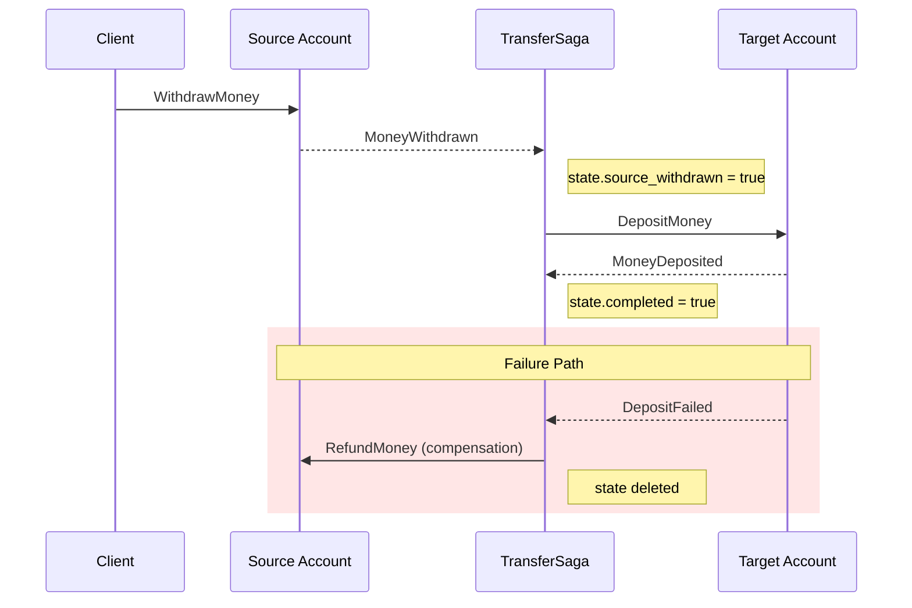
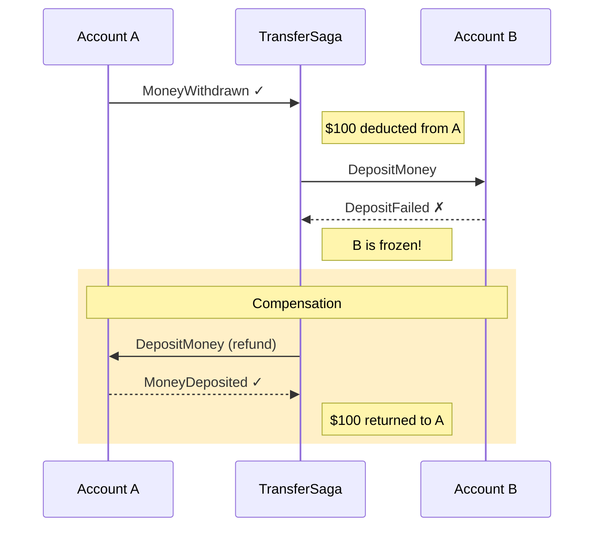

# Sagas

Orchestrate long-running, multi-step business processes that span multiple aggregates.

## Goal

Implement complex workflows that coordinate multiple aggregates while maintaining 
consistency through stateful, event-driven orchestration.

## Prerequisites

- Understanding of [Event Processors](../concepts/event-processors.md)
- Familiarity with the [Tutorial](../tutorial/index.md)

## What is a Saga?

A **saga** is a stateful event processor that coordinates long-running business 
processes spanning multiple aggregates. Unlike simple event processors that react 
to individual events, sagas:

- **Maintain state** across multiple events
- **Track progress** through multi-step workflows
- **Handle failures** with compensation logic
- **Guarantee idempotency** — each step runs exactly once

Think of a saga as a state machine driven by domain events.

## When to Use Sagas

| Use Sagas When | Use Event Processors When |
|----------------|---------------------------|
| Process spans multiple aggregates | Reacting to single events |
| Need to track progress across steps | Building read models (projections) |
| Require compensation on failure | Sending notifications |
| Order of operations matters | No state between events needed |

## Example: Money Transfer

Let's build a saga that coordinates transferring money between two bank accounts.
The saga listens to events from both accounts and tracks progress:



The saga acts as an **orchestrator**: it receives events from aggregates and 
dispatches commands to coordinate the workflow.

## Defining Saga State

First, define the state your saga needs to track:

```python
from pydantic import BaseModel
from decimal import Decimal
from uuid import UUID, uuid4

class TransferState(BaseModel):
    """State for a money transfer saga."""
    transfer_id: str
    from_account: UUID
    to_account: UUID
    amount: Decimal
    source_withdrawn: bool = False
    target_deposited: bool = False
    completed: bool = False
```

The state is a Pydantic model that gets persisted between events.

## Defining Events

Events that drive the saga need a `saga_id` property to correlate them with 
the correct saga instance. You have two options:

### Option 1: Direct Field

Add a `saga_id` field directly:

```python
from pydantic import BaseModel
from decimal import Decimal

class TransferInitiated(BaseModel):
    saga_id: str  # Direct field
    from_account: str
    to_account: str
    amount: Decimal

class TransferCompleted(BaseModel):
    saga_id: str

class TransferFailed(BaseModel):
    saga_id: str
    reason: str
```

### Option 2: Computed Property

Use a computed property when the saga ID derives from another field:

```python
class OrderShipped(BaseModel):
    order_id: str
    tracking_number: str
    
    @property
    def saga_id(self) -> str:
        return self.order_id  # Computed from order_id
```

This keeps your domain events clean while satisfying the saga convention.

!!! tip "Custom Extractor (Escape Hatch)"
    Use the `saga_id` parameter on `@saga_step` when:
    
    - An event participates in **multiple sagas** that need different correlation IDs
    - You can't modify the event class
    
    ```python
    @saga_step(saga_id=lambda e: f"order-{e.order_id}")
    async def on_payment_received(self, event: PaymentReceived) -> State:
        ...
    ```

## Implementing the Saga

Sagas extend `Saga[StateType]` and use the `@saga_step` decorator:

```python
from interlock.application.events.processing import Saga, SagaStateStore, saga_step

class MoneyTransferSaga(Saga[TransferState]):
    """Coordinates money transfer between accounts."""
    
    def __init__(self, state_store: SagaStateStore):
        super().__init__(state_store)
    
    @saga_step  # (1)!
    async def on_transfer_initiated(
        self, 
        event: TransferInitiated
    ) -> TransferState:
        """First step: create initial state."""
        return TransferState(
            transfer_id=event.saga_id,
            from_account=event.from_account,
            to_account=event.to_account,
            amount=event.amount,
        )
    
    @saga_step
    async def on_source_withdrawn(
        self, 
        event: SourceWithdrawn, 
        state: TransferState  # (2)!
    ) -> TransferState:
        """Subsequent step: receives existing state."""
        state.source_withdrawn = True
        return state
    
    @saga_step
    async def on_target_deposited(
        self, 
        event: TargetDeposited, 
        state: TransferState
    ) -> TransferState:
        """Mark transfer as complete."""
        state.target_deposited = True
        state.completed = True
        return state
    
    @saga_step
    async def on_transfer_failed(
        self, 
        event: TransferFailed, 
        state: TransferState
    ) -> None:  # (3)!
        """Cleanup: return None to delete state."""
        # Compensation logic would go here
        return None
```

1. `@saga_step` provides automatic event routing, idempotency, and state management
2. Subsequent steps receive the current state as a parameter
3. Return `None` to delete state (cleanup after completion or failure)

## Handler Patterns

The `@saga_step` decorator infers behavior from your function signature:

| Signature | Behavior |
|-----------|----------|
| `async def handler(self, event) -> State` | **Initial step**: Creates new state |
| `async def handler(self, event, state) -> State` | **Subsequent step**: Receives and updates state |
| `async def handler(self, event, state) -> None` | **Cleanup step**: Deletes state |

## Automatic Idempotency

Each saga step runs **exactly once** per saga instance. If the same event is 
processed again (e.g., due to retries), the step is skipped:

```python
# First time: step executes
await saga.handle(TransferInitiated(saga_id="t-1", ...))

# Second time: step skipped (idempotent)
await saga.handle(TransferInitiated(saga_id="t-1", ...))
```

The `SagaStateStore` tracks which steps have completed for each saga instance.

## Registering Sagas

Sagas are registered like any other event processor:

```python
from interlock.application import ApplicationBuilder
from interlock.application.events.processing import SagaStateStore

app = (
    ApplicationBuilder()
    .register_aggregate(BankAccount)
    .register_event_processor(MoneyTransferSaga)  # (1)!
    .build()
)
```

1. Sagas are just specialized event processors — no special registration needed

The `SagaStateStore` is automatically provided (in-memory by default). For 
production, register a persistent implementation:

```python
app = (
    ApplicationBuilder()
    .register_dependency(SagaStateStore, PostgresSagaStateStore)
    .register_event_processor(MoneyTransferSaga)
    .build()
)
```

## Testing Sagas

Use `SagaScenario` or `app.saga_scenario()` for testing:

```python
import pytest
from interlock.application.events.processing import SagaStateStore
from interlock.testing import SagaScenario

@pytest.fixture
def app():
    return (
        ApplicationBuilder()
        .register_event_processor(MoneyTransferSaga)
        .build()
    )

@pytest.mark.asyncio
async def test_transfer_creates_initial_state(app):
    async with app.saga_scenario(MoneyTransferSaga) as scenario:
        scenario \
            .given(
                TransferInitiated(
                    saga_id="transfer-1",
                    from_account="acc-1",
                    to_account="acc-2",
                    amount=Decimal("100.00"),
                )
            ) \
            .should_have_state(
                "transfer-1",  # saga_id to check
                lambda s: s.transfer_id == "transfer-1" and not s.completed
            )

@pytest.mark.asyncio
async def test_transfer_completes_successfully(app):
    async with app.saga_scenario(MoneyTransferSaga) as scenario:
        scenario \
            .given(
                TransferInitiated(
                    saga_id="transfer-1",
                    from_account="acc-1",
                    to_account="acc-2",
                    amount=Decimal("100.00"),
                ),
                SourceWithdrawn(saga_id="transfer-1"),
                TargetDeposited(saga_id="transfer-1"),
            ) \
            .should_have_state("transfer-1", lambda s: s.completed)

@pytest.mark.asyncio
async def test_failed_transfer_cleans_up_state(app):
    async with app.saga_scenario(MoneyTransferSaga) as scenario:
        scenario \
            .given(
                TransferInitiated(
                    saga_id="transfer-1",
                    from_account="acc-1",
                    to_account="acc-2",
                    amount=Decimal("100.00"),
                ),
                TransferFailed(saga_id="transfer-1", reason="Insufficient funds"),
            ) \
            .should_have_state("transfer-1", lambda s: s is None)  # State deleted
```

## Understanding Compensation

In distributed systems, you can't use traditional database transactions across 
multiple aggregates or services. Instead, sagas use **compensation**—the process 
of semantically undoing the effects of previous steps when a later step fails.

### Why Compensation?

Consider our money transfer saga:

1. ✅ **Step 1**: Withdraw $100 from Account A → `MoneyWithdrawn`
2. ❌ **Step 2**: Deposit $100 to Account B → `DepositFailed` (account frozen!)

At this point, we've taken money from Account A but failed to deliver it to 
Account B. The money is "in limbo." We need to **compensate** Step 1 by 
depositing the money back into Account A.



### Compensation vs Rollback

| Database Rollback | Saga Compensation |
|-------------------|-------------------|
| Automatically undoes all changes | You must explicitly define undo logic |
| All-or-nothing | Each step may partially complete |
| Synchronous | Asynchronous, eventual consistency |
| Hidden from domain | Part of your domain model |

### Designing Compensating Actions

Every saga step that changes state should have a corresponding compensation:

| Forward Action | Compensating Action |
|----------------|---------------------|
| `WithdrawMoney` | `DepositMoney` (refund) |
| `ReserveInventory` | `ReleaseInventory` |
| `ChargePayment` | `RefundPayment` |
| `SendEmail` | _(often not compensatable)_ |

!!! warning "Not Everything Can Be Compensated"
    Some actions are inherently non-compensatable (sending an email, calling 
    an external API). Design your saga to perform these last, or accept that 
    some compensations are "best effort."

## Compensation Patterns

Now let's look at how to implement compensation in your sagas:

### Pattern 1: Inject CommandBus (Recommended)

Inject the `CommandBus` to dispatch compensation commands:

```python
from interlock.application.commands import CommandBus

class MoneyTransferSaga(Saga[TransferState]):
    def __init__(self, state_store: SagaStateStore, command_bus: CommandBus):
        super().__init__(state_store)
        self.command_bus = command_bus
    
    @saga_step
    async def on_transfer_failed(
        self, 
        event: TransferFailed, 
        state: TransferState
    ) -> None:
        if state.source_withdrawn:
            # Compensate: refund the source account
            await self.command_bus.dispatch(
                DepositMoney(
                    aggregate_id=state.from_account,  # Already a UUID
                    amount=int(state.amount),
                )
            )
        return None
```

The `CommandBus` is automatically registered by the framework—no extra setup needed:

```python
app = (
    ApplicationBuilder()
    .register_event_processor(MoneyTransferSaga)  # CommandBus injected automatically
    .build()
)
```

!!! tip "Depend on What You Need"
    Injecting `CommandBus` instead of `Application` follows the principle of 
    minimal dependencies. The saga only needs to dispatch commands, not access 
    the entire application.

### Pattern 2: External Compensation Service

For complex compensation logic, use a dedicated service:

```python
class CompensationService(ABC):
    @abstractmethod
    async def compensate_transfer(self, state: TransferState) -> None:
        ...

class MoneyTransferSaga(Saga[TransferState]):
    def __init__(
        self, 
        state_store: SagaStateStore, 
        compensation: CompensationService
    ):
        super().__init__(state_store)
        self.compensation = compensation
    
    @saga_step
    async def on_transfer_failed(
        self, 
        event: TransferFailed, 
        state: TransferState
    ) -> None:
        await self.compensation.compensate_transfer(state)
        return None
```

## Custom Saga ID Extraction

The custom `saga_id` extractor is an escape hatch for special cases:

### Event Participates in Multiple Sagas

When the same event drives different sagas with different correlation:

```python
class PaymentReceived(BaseModel):
    payment_id: str
    order_id: str
    subscription_id: str

# Order fulfillment saga uses order_id
class OrderFulfillmentSaga(Saga[OrderState]):
    @saga_step(saga_id=lambda e: e.order_id)
    async def on_payment_received(self, event: PaymentReceived) -> OrderState:
        ...

# Subscription saga uses subscription_id
class SubscriptionSaga(Saga[SubscriptionState]):
    @saga_step(saga_id=lambda e: e.subscription_id)
    async def on_payment_received(self, event: PaymentReceived) -> SubscriptionState:
        ...
```

### Can't Modify the Event Class

When working with events from external systems or shared libraries:

```python
# External event you can't modify
class ExternalOrderEvent(BaseModel):
    order_number: str  # No saga_id property
    status: str

class OrderSaga(Saga[OrderState]):
    @saga_step(saga_id=lambda e: e.order_number)
    async def on_external_order(self, event: ExternalOrderEvent) -> OrderState:
        ...
```

!!! note "Prefer the Convention"
    When possible, add a `saga_id` field or computed property to your events.
    The custom extractor adds indirection and is harder to trace.

## State Store Implementations

The default in-memory store is good for development and testing:

```python
from interlock.application.events.processing import SagaStateStore

store = SagaStateStore.in_memory()
```

!!! warning "Not for Production"
    The in-memory store loses all data when the application stops.

For production, see [Database Integrations](database-integrations.md) for persistent 
`SagaStateStore` implementations.

## Best Practices

1. **Design for failure**: Every step that changes state should have a compensation path
2. **Keep steps small**: Each step should do one thing well
3. **Use meaningful step names**: They appear in logs and state tracking
4. **Test compensation paths**: Don't just test the happy path
5. **Monitor saga progress**: Log state transitions for debugging
6. **Set timeouts**: Handle sagas that get stuck (external monitoring)
7. **Idempotent compensations**: Compensation steps may also be retried

## Summary

| Concept | Description |
|---------|-------------|
| **Saga[TState]** | Base class for stateful sagas |
| **@saga_step** | Decorator for saga event handlers |
| **SagaStateStore** | Abstract storage for saga state |
| **saga_id** | Correlates events to saga instances |
| **Initial step** | `handler(event) -> State` — creates state |
| **Subsequent step** | `handler(event, state) -> State` — updates state |
| **Cleanup step** | `handler(event, state) -> None` — deletes state |

## Next Steps

- [Event Processors](../concepts/event-processors.md) — Simpler event handling
- [Writing Tests](writing-tests.md) — Testing strategies
- [API Reference](../reference/index.md) — Complete API documentation
