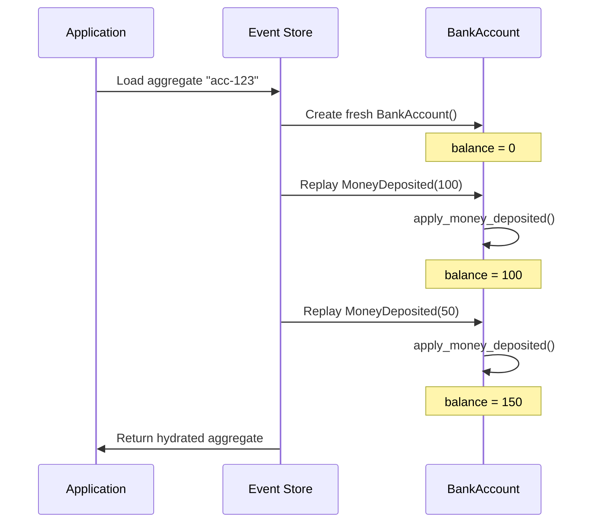

# Events & Sourcing

In the previous section, we wrote a command handler that directly mutated state. 
However, event sourcing is a key principle of Interlock and direct mutation is a violation of that principle.
Instead, we rely on the capturing and application of events to record and update the state of the aggregate.
That is the essence of event sourcing.

## The Problem with Direct Mutation

Here's what we wrote in the last section:

```python
@handles_command
def handle_deposit_money(self, command: DepositMoney) -> None:
    self.balance.increase(command.amount)  # Direct mutation!
```

This has several weaknesses that we hope to address with an event sourced system:

1. **No history**: We only know the current balance, not how we got there
2. **No auditability**: We can't answer "what happened to this account?"
3. **No replay**: We can't rebuild state from scratch
4. **No projections**: We can't notify other systems about what happened

## What is an Event?

An **event** is an immutable record of something that happened. Events are:

- Conventionally named in **past tense** (e.g., `AccountCreated`, `MoneyDeposited`)
- **Immutable**—once created, they never change (except for [upcasting](../guides/event-upcasting.md))
- Contain all the data needed to understand what happened over an aggregate's lifetime
- Are the **source of truth** for aggregate state and are the basis for projections and other derived data.

## Defining Events

Events, like commands and aggregates, are pydantic models. In fact, they are literally pydantic models.
There is no special event class that you need to inherit from.

```python
from pydantic import BaseModel

class MoneyDeposited(BaseModel):
    account_aggregate_id: ULID
    amount: int
```

!!! note "Events don't need an aggregate_id"
    In this example, we do include the `account_aggregate_id` field.
    However, unlike commands, event payloads don't need to specify which aggregate they belong to.
    The framework tracks this automatically when events are applied to the appropriate aggregate.

## Fixing Our Command Handler

Instead of directly mutating state, command handlers should **emit events**:

```python hl_lines="4"
@handles_command
def handle_deposit_money(self, command: DepositMoney) -> None:
    # Don't mutate directly—apply an event instead!
    self.emit(MoneyDeposited(amount=command.amount, account_aggregate_id=self.id))
```

The `emit()` method does two things:

1. Records the event (for persistence and projections)
2. Applies the event to the aggregate. 

## Event Handlers

Event handlers are where state actually changes. They're marked with the `@applies_event` decorator:

```python
@applies_event
def apply_money_deposited(self, event: MoneyDeposited) -> None:
    self.balance.increase(event.amount)
```

## The Complete Fixed Aggregate

Let's put it all together:

```python hl_lines="12-14 23-26 28-30"
from pydantic import BaseModel, Field
from ulid import ULID
from interlock.domain import Aggregate
from interlock.routing import handles_command, applies_event

class Balance(BaseModel):
    amount: int = 0
    currency: str = "USD"

    def increase(self, amount: int) -> None:
        self.amount += amount

class MoneyDeposited(BaseModel):
    amount: int
    account_aggregate_id: ULID

class BankAccount(Aggregate):
    balance: Balance = Field(default_factory=Balance)
    is_active: bool = True

    def has_sufficient_balance(self, amount: int) -> bool:
        return self.balance.amount >= amount

    @handles_command
    def handle_deposit_money(self, command: DepositMoney) -> None:
        event = MoneyDeposited(amount=command.amount, account_aggregate_id=self.id)
        self.emit(event)  # (2)!

    @applies_event
    def apply_money_deposited(self, event: MoneyDeposited) -> None:  # (3)!
        self.balance.increase(event.amount)
```

Ultimately handling commands and events forms the core of the aggregate pattern:
1. Define a command that represents the action that happened
2. Define the event that records what happened
3. Emit the event instead of mutating directly
4. Apply the event to the aggregate to update state



We've now officially event sourced something!! 

## Updating Our Test

Interlock provides testing utilities that make it easy to write expressive, 
behavior-driven tests. Let's use `AggregateScenario`:

```python
from interlock.testing import AggregateScenario

async def test_deposit_money_emits_event():
    async with AggregateScenario(BankAccount) as scenario:
        scenario \
            .given_no_events() \
            .when(DepositMoney(aggregate_id=scenario.aggregate_id, amount=50)) \
            .should_emit(MoneyDeposited)  # (1)!
```

1. You can assert on the event type or an exact event instance

The scenario automatically generates an `aggregate_id` accessible via `scenario.aggregate_id`.

The scenario follows the **Given-When-Then** pattern:

- **Given**: The starting state (events that already happened)
- **When**: The command being tested
- **Should**: The expected outcome (events emitted, state changes, or errors)

You can also assert on the resulting state:

```python
async def test_deposit_money_updates_balance():
    async with AggregateScenario(BankAccount) as scenario:
        scenario \
            .given_no_events() \
            .when(DepositMoney(aggregate_id=scenario.aggregate_id, amount=50)) \
            .should_have_state(lambda acc: acc.balance.amount == 50)
```

Or test behavior that depends on prior events:

```python
async def test_multiple_deposits():
    async with AggregateScenario(BankAccount) as scenario:
        scenario \
            .given(MoneyDeposited(amount=100, account_aggregate_id=scenario.aggregate_id)) \
            .when(DepositMoney(aggregate_id=scenario.aggregate_id, amount=50)) \
            .should_emit(MoneyDeposited) \
            .should_have_state(lambda acc: acc.balance.amount == 150)
```

!!! tip "Given-When-Then"
    This pattern maps naturally to event sourcing: "given these events happened, 
    when this command is executed, then these events should be emitted."

## Next Steps

Now that we understand events and sourcing, let's learn how to 
[react to events outside of the aggregate with Event Processors](04-event-processors.md).
