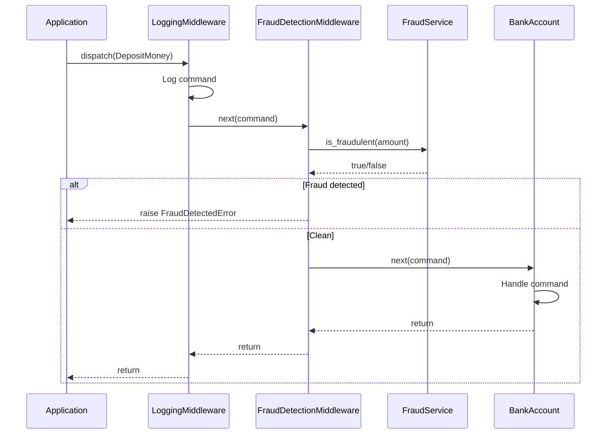

# Middleware

Middleware wraps command execution to add cross-cutting concerns like logging, metrics, and error handling.
**Middleware** intercepts commands before and/or after they're handled. Use middleware for:

- Logging and tracing
- Authentication and authorization
- Fraud detection
- Rate limiting
- Performance monitoring

## Creating Custom Middleware

Let's build a fraud detection middleware that checks transactions against a fraud service.
First, we'll define a service interface and implementation:

```python
from abc import ABC, abstractmethod
import random

class FraudService(ABC):
    """Service for detecting fraudulent transactions."""

    @abstractmethod
    def is_fraudulent(self, amount: int) -> bool:
        """Check if a transaction amount is suspicious."""
        ...

class RandomFraudService(FraudService):
    """A silly fraud service that randomly flags transactions."""

    def __init__(self, fraud_probability: float = 0.1):
        self.fraud_probability = fraud_probability

    def is_fraudulent(self, amount: int) -> bool:
        return random.random() < self.fraud_probability
```

## Writing Tests First

Before implementing the middleware, let's write tests to define the expected behavior.
We'll create a testable fraud service that we can control:

```python
class StubFraudService(FraudService):
    """A controllable fraud service for testing."""
    
    def __init__(self, is_fraud: bool = False):
        self._is_fraud = is_fraud
    
    def is_fraudulent(self, amount: int) -> bool:
        return self._is_fraud
```

Now let's create a fixture that builds an app with the stub service:

```python
import pytest
from interlock.application import ApplicationBuilder

@pytest.fixture
def app_with_fraud_detection():
    """Build an app that always flags transactions as fraudulent."""
    return (
        ApplicationBuilder()
        .register_aggregate(BankAccount)
        .register_dependency(FraudService, lambda: StubFraudService(is_fraud=True))
        .register_middleware(FraudDetectionMiddleware)
        .build()
    )

@pytest.fixture
def app_without_fraud():
    """Build an app that never flags transactions."""
    return (
        ApplicationBuilder()
        .register_aggregate(BankAccount)
        .register_dependency(FraudService, lambda: StubFraudService(is_fraud=False))
        .register_middleware(FraudDetectionMiddleware)
        .build()
    )
```

Now we can test the middleware through the application:

```python
async def test_middleware_blocks_fraudulent_deposits(app_with_fraud_detection):
    async with app_with_fraud_detection:
        with pytest.raises(FraudDetectedError):
            await app_with_fraud_detection.dispatch(
                DepositMoney(aggregate_id=ULID(), amount=100)
            )

async def test_middleware_allows_clean_deposits(app_without_fraud):
    async with app_without_fraud:
        # Should not raise - deposit goes through
        await app_without_fraud.dispatch(
            DepositMoney(aggregate_id=ULID(), amount=100)
        )
```

!!! tip "Testing with DI"
    By swapping the `FraudService` implementation in the fixture, we can test
    different scenarios without changing our middleware code.

## Implementing the Middleware

Now let's implement the middleware:

```python
from interlock.application.commands import CommandMiddleware, CommandHandler
from interlock.routing import intercepts

class FraudDetectionMiddleware(CommandMiddleware):
    """Check transactions against a fraud detection service."""

    def __init__(self, fraud_service: FraudService):  # (1)!
        self.fraud_service = fraud_service

    @intercepts  # (2)!
    async def check_deposit(
        self, 
        command: DepositMoney,  # (3)!
        next: CommandHandler
    ) -> None:
        if self.fraud_service.is_fraudulent(command.amount):
            raise FraudDetectedError(
                f"Suspicious deposit of {command.amount} detected!"
            )
        await next(command)  # (4)!
```

1. The `FraudService` dependency is **automatically injected** by the DI container
2. The `@intercepts` decorator marks this method as a command interceptor
3. Type annotation determines which commands this method intercepts
4. Call `await next(command)` to pass control to the next middleware

!!! tip "Selective Interception"
    Middleware methods only intercept commands matching their type annotation.
    To intercept *all* commands, annotate with the base `Command` type.

## Using Built-in Middleware

Interlock provides several built-in middleware. Let's use `LoggingMiddleware`:

```python
from interlock.application.commands.middleware import LoggingMiddleware
```

`LoggingMiddleware` logs each command with correlation context for distributed tracing.
It takes a log level as a parameter:

```python
LoggingMiddleware("INFO")   # Log at INFO level
LoggingMiddleware("DEBUG")  # Log at DEBUG level
```

## Registering Middleware

Register middleware and its dependencies with the `ApplicationBuilder`:

```python
from interlock.application import ApplicationBuilder
from interlock.application.commands.middleware import LoggingMiddleware

app = (
    ApplicationBuilder()
    .register_aggregate(BankAccount)
    .register_dependency(FraudService, RandomFraudService)  # (1)!
    .register_middleware(LoggingMiddleware)
    .register_middleware(FraudDetectionMiddleware)  # (2)!
    .build()
)
```

1. Register `RandomFraudService` as the implementation of `FraudService`
2. When `FraudDetectionMiddleware` is created, the container injects `FraudService` automatically

This is the power of dependency injection—your middleware doesn't need to know *which* 
fraud service implementation it's using. You can easily swap `RandomFraudService` for 
a real `MLFraudService` in production without changing the middleware code.

!!! note "Middleware Order"
    Middleware executes in registration order. `LoggingMiddleware` runs first, 
    then `FraudDetectionMiddleware`, then the aggregate handler.

## The Middleware Chain

When a command is dispatched, it flows through the middleware chain:



## Other Built-in Middleware

| Middleware | Purpose |
|------------|---------|
| `LoggingMiddleware` | Log commands with correlation context |
| `IdempotencyMiddleware` | Prevent duplicate command processing |
| `ConcurrencyRetryMiddleware` | Retry on optimistic concurrency conflicts |
| `ContextPropagationMiddleware` | Propagate correlation/causation IDs |

## Next Steps

Now let's learn about [Structuring Your Application](06-structuring-the-application.md) with conventions.
