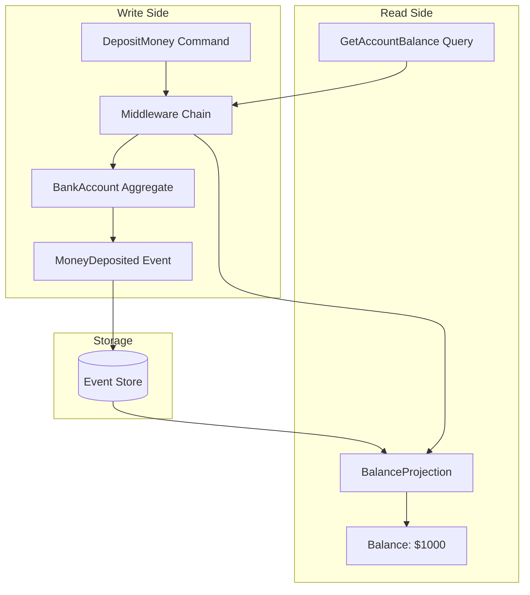

# Putting It Together

Congratulations! You've learned the core concepts of Interlock. 
Now let's see how everything fits together in a complete application.

## Complete Bank Account Example

Here's the full project structure following Interlock conventions:

### Project Structure

```
bank_app/
├── __init__.py
├── aggregates/
│   ├── __init__.py
│   └── bank_account.py
├── events/
│   ├── __init__.py
│   └── account_events.py
├── commands/
│   ├── __init__.py
│   └── account_commands.py
├── queries/
│   ├── __init__.py
│   └── account_queries.py
├── projections/
│   ├── __init__.py
│   └── balance_projection.py
├── middleware/
│   ├── __init__.py
│   └── fraud_detection.py
├── services/
│   ├── __init__.py
│   └── fraud_service.py
└── main.py
```

### The Application

Using the convention-based approach from the previous section:

```python
# main.py
import asyncio
from uuid import UUID, uuid4
from interlock.application import ApplicationBuilder

from bank_app.commands.account_commands import OpenAccount, DepositMoney
from bank_app.queries.account_queries import GetAccountBalance, GetAccountByEmail
from bank_app.services.fraud_service import FraudService, MLFraudService

async def main():
    app = (
        ApplicationBuilder()
        .convention_based("bank_app")  # (1)!
        .register_dependency(FraudService, MLFraudService)  # (2)!
        .build()
    )

    async with app:
        # Create an account
        account_id = uuid4()
        await app.dispatch(OpenAccount(
            aggregate_id=account_id,
            owner_name="Alice",
            email="alice@example.com"
        ))

        # Make deposits
        await app.dispatch(DepositMoney(
            aggregate_id=account_id,
            amount=1000
        ))
        
        # Query the balance
        balance = await app.query(GetAccountBalance(account_id=account_id))
        print(f"Balance: ${balance}")
        
        # Look up by email
        found_id = await app.query(GetAccountByEmail(email="alice@example.com"))
        print(f"Found account: {found_id}")

if __name__ == "__main__":
    asyncio.run(main())
```

1. Auto-discovers all aggregates, projections, and middleware in `bank_app`
2. Explicitly registers the production fraud service implementation

### Running Event Processors

For long-running projections, run processors separately:

```python
from interlock.application import ApplicationBuilder
from bank_app.projections.balance_projection import AccountBalanceProjection

async def run_processors():
    app = (
        ApplicationBuilder()
        .convention_based("bank_app")
        .build()
    )

    async with app:
        # Run processors until interrupted
        await app.run_event_processors(
            AccountBalanceProjection,
        )
```

## The Complete Flow

Here's how commands and queries flow through the system:



## Recap: What We've Learned

| Section | Concept |
|---------|---------|
| [Aggregates](01-your-first-aggregate.md) | Domain objects that encapsulate state |
| [Commands](02-commands-and-handlers.md) | Messages that express intent to change |
| [Events](03-events-and-sourcing.md) | Immutable records of what happened |
| [Event Processors](04-event-processors.md) | Build read models from events |
| [Queries & Projections](05-queries-and-projections.md) | Serve typed queries from read models |
| [Middleware](06-middleware.md) | Cross-cutting concerns via interception |
| [Structure](07-structuring-the-application.md) | Convention-based organization |

## What's Next?

You now have a solid foundation in Interlock! Continue your learning:

<div class="grid cards" markdown>

-   :material-book:{ .lg .middle } __Concepts__

    ---

    Deep dive into CQRS and Event Sourcing theory

    [:octicons-arrow-right-24: Concepts](../concepts/index.md)

-   :material-wrench:{ .lg .middle } __Guides__

    ---

    Task-focused how-to guides for specific features

    [:octicons-arrow-right-24: Guides](../guides/index.md)

-   :material-api:{ .lg .middle } __API Reference__

    ---

    Complete API documentation

    [:octicons-arrow-right-24: Reference](../reference/index.md)

</div>
